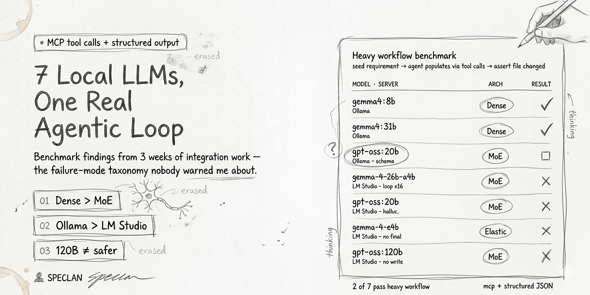

# I Gave Seven Local LLMs a Real Job. Two Did It.

*Small models are winning the chat benchmarks. Then I gave them multi-step agentic work with MCP tools — and only two held up. A three-week spike through Ollama and LM Studio.*



## Small models had their moment — then I gave them real work

Something has changed in 2026 that a lot of developers haven't fully internalized yet.

A year ago, running anything useful locally meant a trade-off: quality for privacy, speed for cost. You accepted a 20% worse answer to keep your data on your laptop. Today Qwen 3.5 dense, Gemma 4 dense, and Llama 3.3 produce output that is genuinely hard to tell apart from Claude Sonnet on the kinds of tasks most developer tooling actually runs — code edits, structured extraction, commit messages, short-form reasoning, small plans. Not in every domain and not for every edge case. But across a huge slice of day-to-day work, the quality gap has collapsed. An 8B dense model that runs on a consumer laptop can handle the majority of what a modern AI coding assistant asks of it.

The business side has shifted in parallel. If you don't want to run your own GPUs, AWS Bedrock, Vercel AI Gateway, Groq, and Together now offer the same open-weights models at cost-plus pricing — a fraction of what frontier API calls cost, with an SLA your procurement team recognizes. The narrative that "you can't run this without OpenAI or Anthropic" stopped being accurate sometime last year, and nobody issued a press release. You can host Gemma 4 or Qwen 3.6 on Bedrock behind a VPC endpoint, never talk to a public API, and pay per-million-token rates that sit well under a cent. For a lot of B2B tooling that is now the path of least resistance — not the exotic alternative.

Underneath both of those: the uncomfortable empirical truth that **most developer tooling does not need a frontier model**. Not because frontier models aren't better — they are, in specific ways — but because the marginal capability above 8–27B open-weights isn't being used by the task. Watch what your agent is actually doing in a trace. A huge fraction of it is format conversion, editing, summarization, short-plan generation, YAML frontmatter hygiene — work that a well-tuned dense open-weights model handles just fine. The occasional hard reasoning step is where the frontier still matters. Most steps aren't that.

So naturally the question every developer-tool builder ends up asking: *how much of my stack can I move off Claude or GPT?* For light, single-shot workloads the answer in 2026 is *basically all of it, with care*. Cheap, private, fast enough, good enough.

For **heavy agentic workloads** — the multi-turn tool-calling loops where the agent reads state, calls tools, inspects results, and decides when to stop — the answer turned out to be more complicated than I expected. That is the gap this post is about.

## A spike to verify the claims

The landscape story above is the pitch. I wanted to test it.

The worry I kept running into was that most "Gemma 4 is amazing!" posts were measured on tasks I don't actually care about as a tool builder — one-shot code snippets, chat coherence, short summaries. That's the *easy* regime. The real work my stack does is agentic: the model reads state, calls tools, inspects results, decides whether to keep going, and — the part almost nobody benchmarks — recognizes that it's finished. That last step is the one that matters, because it's the one that corrupts files on disk when it breaks. A chat model that gets a fact slightly wrong is irritating. An agent that doesn't know when to stop calling `update_record` flattens your document and walks off grinning.

So I picked a deliberately representative workload. A multi-step loop with real MCP tools: the agent walks a codebase, proposes a hierarchical structure a few levels deep, and writes findings to disk through typed tool calls like `update_record` and `create_section`. The same harness I use with Claude Sonnet, GPT-5, and Gemini every day — all three handle it without drama. Swap the model, hold everything else constant, and see what happens.

The goal wasn't a paper. It was a spike: a few days of concentrated effort to answer a single question. *If the "small models are good enough now" narrative is true, can I point this thing at a local dense 8B and keep working?*

I set aside a weekend, thinking it would be a config change.

It was three weeks.

## Two workloads, one undifferentiated benchmark landscape

Here's the first thing I had to un-learn. Almost every local-LLM benchmark measures **chat quality** — coherence, factual accuracy, conversational ability, maybe some code generation. These benchmarks don't meaningfully separate the two workloads I actually care about.

**Light workloads** — single prompt in, single response out. "Rewrite this paragraph." "Generate a commit message." "Clean up this YAML frontmatter." Any 8B-and-up instruction-tuned model handles these fine on almost any server. If you only need light workloads, local LLMs in 2026 are a solved problem.

**Heavy workloads** — multi-turn tool-calling loops. The model reads some state, decides to call a tool, inspects the result, decides whether to continue or stop, eventually terminates. It requires reasoning, instruction-following, and the one nobody talks about: **self-termination**. The model has to recognize "the tool returned success, I am done" and stop calling.

Every failure I'm going to describe lives in the heavy category. It is a genuinely different problem, and chat benchmarks do not predict it.

## The integration walls that ate days

Before I even got to the interesting model-capability failures, I had to get past three integration paper-cuts. Boring, trivial-in-hindsight, and each one ate a day.

**The SDK config cache.** This one is nasty. The `@openai/agents` SDK caches its internal OpenAI HTTP client on the first `run()` call of the process. After that — and I tested every documented setter — `OPENAI_BASE_URL`, `setDefaultOpenAIKey`, `setDefaultOpenAIClient` are **all silently ignored**. You cannot switch providers inside a running process. I burned two days on three escalating workarounds before I accepted this as architectural:

1. Scoped environment variable injection per request — broke after the first query, because the SDK had already cached the client.
2. Per-agent `new OpenAI({baseURL})` passed into `setDefaultOpenAIClient` — the injected client was also ignored after the first one.
3. A custom-fetch router at module scope — a single `OpenAI` client with a custom `fetch` that rewrites URLs at request time, reading the target from a mutable holder. This actually works, but it introduces module-global state and it only handles Local-to-Local transitions. Local-to-Cloud-OpenAI is still broken.

I shipped a "Reload Window" toast. When the user changes the Local LLM URL in settings, they see *"Reload to apply — the SDK caches the first URL and ignores later changes."* One API call, no magic, works for every provider transition. Friction for the user, but a working tool afterward beats 13-millisecond silent misroutes to the wrong server.

If you're building on `@openai/agents` and letting users switch providers at runtime, save yourself two days and plan around a process restart from the start.

**Structured-output wrappers.** My pipeline expects a wrapped object — `{ changes: [...], reasoning: "..." }`. A local Gemma returned a raw array. Downstream code called `response.changes.map(...)` and crashed. Root cause turned out to be subtle: the helper that injects the schema text into the prompt had been refactored to take `{ schemaHint: string }`, but the caller was still passing the schema as a positional argument, which the new signature silently ignored. The schema was never reaching the prompt. A local model, given no guidance, produced whatever shape the words literally suggested — a reasonable array, because that's what you'd do if told "return the changes as JSON."

Lesson: strong cloud models infer the wrapped-object convention from training. Weak local models don't. If your pipeline doesn't explicitly inject schema text into the prompt itself, your local model doesn't see it. Don't trust the SDK to do this for you.

Three paper-cuts, three fixes, one regression test each. Three days.

## The capability walls that were the real story

By the second week I had all three integration bugs cleared and was finally running the real workflow on a real local model — `gemma-4-26b-a4b` on LM Studio, a 26-billion-parameter MoE. The first phase — structure inference — was dazzling. Three top-level groups, seven child sections, sensible user-centric naming, all produced from a codebase walk. I grinned at the screen. *This is going to work.*

It was Friday, 10pm. The second phase started — content population — and I watched the log scroll past without processing what I was seeing:

```
18:56:25  update_record → E-0049
18:56:25  update_record → E-0049
18:56:26  update_record → E-0049
18:56:26  update_record → E-0049
…
```

Same tool. Same target. Same arguments. Sixteen times, until the agent ran out of turns. The file on disk was garbage — the description had been jammed into the `title:` field of the YAML frontmatter, and the body was still the template placeholder. I was three hours into my seventh restart of the evening. This wasn't supposed to be hard.

A week earlier, a smaller Gemma 4 dense running on Ollama had passed the exact same test, producing clean well-formed records through the same MCP tools without a hitch. The difference between *shipped* and *destroyed my data* turned out to be one letter in the model's name and one choice of inference server. I didn't know that yet.

This is the first capability failure mode: **the tool-call loop**. The model sees the tool result, doesn't trust it or doesn't understand it, and calls again. Google's own Gemma 4 documentation acknowledges it: Gemma can emit multiple tool calls per turn and has no built-in loop termination. MoE and MatFormer variants are particularly prone. You can paper over it with application-layer loop detection — track the last N `(tool_name, args_hash)` tuples, interrupt after K repeats — but the underlying model will not stop on its own.

I switched to `openai/gpt-oss-20b` on LM Studio, hoping a larger, more agent-oriented model would behave better. The trace looked clean: one tool call, clean arguments, a final answer that read:

> *"I read the current state of E-8881 and updated its description with the full content: [detailed, convincing summary of changes]"*

The file on disk was unchanged.

This is failure mode two: **the hallucinated success**. The tool call happened — I saw it in the trace — but either the arguments were malformed in a way the MCP server silently ignored, or the model narrated its plan as a completion. It is *worse* than the loop, because it passes the "did any tools get called?" check but the actual work never happened. Your test suite goes green. Your user's data is untouched, and they don't know.

A third, separate failure mode surfaced while I was testing a different pattern in the same spike — an inline document-editor pattern, the kind of thing where you run a slash-command on a piece of Markdown and the model returns the modified document. `/add Examples`, `/summarize`, `/refine`, that sort of thing. The caller hands the model the full document plus the instruction, and replaces the document on disk with whatever comes back.

With Claude or GPT-5.2, this works — strong models default to echoing the full document with the transformation applied. I ran `/add Examples` on a five-section document through `gemma-4-26b-a4b` and got back three sentences. The naive replace-on-disk logic, doing exactly what it was told, clobbered the entire document with those three sentences.

Silent data loss. Call it **weak-model edit-as-replace**. The model did exactly what the prompt literally said. It just failed to infer the invariant that any frontier model would have inferred.

I fixed it at the prompt layer — a block titled `DOCUMENT COMPLETENESS RULE (NON-NEGOTIABLE)` that spelled out, in all-caps, that the response must contain the entire document. And I built a harness that runs 24 cases against the prompts in the actual tool, every time we change them, so this class of regression can't come back quietly. But the fact that prompt engineering fixes a data-loss bug is, itself, the whole story. With frontier models the prompt is a hint. With weak local models the prompt is a contract, and any invariant you don't spell out, you don't get.

## The benchmark

I got tired of running one-off tests and built a focused E2E case: seed a record, ask the agent to populate it with a description and a set of examples, then measure three things — did it call the right tool, did it call the same tool with the same args more than three times (loop), did the file on disk actually change.

| Server | Model | Architecture | Heavy workflow | Failure mode |
|---|---|---|---|---|
| Ollama | `gemma4:latest` (8B) | Dense | **PASS** | — |
| Ollama | `gemma4:31b` | Dense | **PASS** | slow but clean |
| Ollama | `gpt-oss:20b` | MoE | PASS tools / FAIL schema | structured-output non-compliance |
| LM Studio | `google/gemma-4-26b-a4b` | MoE | **FAIL** | tool-call loop × 16 |
| LM Studio | `openai/gpt-oss-20b` | MoE | **FAIL** | hallucinates completion |
| LM Studio | `google/gemma-4-e4b` | Elastic (MatFormer) | **FAIL** | "no final response" |
| LM Studio | `openai/gpt-oss-120b` | MoE | **FAIL** | tool called, file unchanged |

Three patterns fell out of that table, and they surprised me.

## Three findings that changed how I pick a local model

**Dense beats MoE and elastic for agentic tool calling.** Every MoE variant failed the heavy workflow. Every elastic / MatFormer variant failed. Every dense variant passed. The [jdhodges 2026 tool-calling benchmark](https://www.jdhodges.com/blog/local-llms-on-tool-calling-2026-pt1-local-lm/) of thirteen local models reports the same pattern — dense 4B–27B models consistently out-calling 26B–70B MoE variants. The intuition seems to be that MoE routing fragments the reasoning needed to recognize "I'm done"; with elastic MatFormer variants, the architecture itself loses coherence on multi-turn plans. If you want multi-turn tool use from a local model today, start dense. (I'm watching the new `Qwen3.6-35B-A3B` closely — it's sparse MoE but specifically post-trained for agentic coding, and it's the first MoE that might break this pattern. Testing it this week.)

**Ollama beats LM Studio on the same weights.** Same `gpt-oss 20B` weights, opposite outcomes. The difference is the tool-call translation layer — the code that sits between the model's native output format and the OpenAI-compatible API the agent SDK expects. Ollama maps this faithfully; LM Studio's current translation loses fidelity in ways that matter for agentic workflows specifically (chat and single-shot prompts are unaffected). This one genuinely surprised me — I had assumed weights dominated and the server was a thin shell. They aren't.

**Size does not rescue you.** `gpt-oss-120b` on LM Studio failed in the same category as its 20B sibling. You cannot out-parameter a chat-template or tool-call-format mismatch. This is good news for people without 4090s: the 8B dense Gemma 4 that runs on my laptop passes the suite that the 120B model on someone's H100 cluster fails. Pick the right model, don't just pick the biggest one.

## What I'd tell myself three weeks ago

- **Heavy agentic workflows:** Ollama, dense model. `gemma4:latest` (8B) and `gemma4:31b` pass my suite. Qwen 3.5/3.6 dense is reportedly the current tool-calling champion — next on my list. Avoid MoE unless explicitly tool-tuned. Avoid elastic / MatFormer for heavy work entirely.
- **Light workloads:** almost any 8B+ instruction-tuned model, either server. Pick on speed.
- **LM Studio trap:** the default 4096-token context is too small for real agentic flows. You will see "Model did not produce a final response" and conclude the model is broken. Bump to 16K+ **and reload the model** — the setting change does not apply retroactively. This eats an hour for everyone who runs into it.
- **"Listed but not loaded":** LM Studio's `/v1/models` endpoint returns models registered in the UI even when they haven't been loaded into memory. Inference calls to unloaded models 404 instantly — indistinguishable from "model doesn't exist" unless you inspect the response body. Test with a real one-token inference probe, not just a `/v1/models` check.

## The bigger picture

The local-LLM story for agentic flows in 2026 is where cloud LLM tool calling was in early 2024: the capability exists, the demos look great, but making it reliable for multi-step workflows requires specific model/harness combinations and a lot of integration polish. Qwen 3.6, Gemma 4 dense, GLM-4.7 are each visibly better than last year — the gap is closing fast. But it hasn't closed.

What has surprised me most, working through this, is how much of the "local LLM doesn't work for agentic flows" narrative online is really a stack-trace mismatch. Dense Gemma 4 on Ollama runs a multi-step tool workflow that I, a few weeks ago, would have told you required Sonnet. You don't need frontier models for this; you need the right model, the right harness, and a prompt you've actually hardened against weak-model literal-mindedness. The hardware bill for the first two goes down every month.

The E2E harness I built for this spike now runs as part of my regular local-model testing — feed a seeded record, run the populate-and-write workflow, assert the file on disk actually changed. I'll keep adding models and posting what I find. If you've stress-tested a real agentic workflow on a local model — especially Qwen 3.6, Llama 3.3, or GLM-4.7 Flash — I'd love to fold your numbers into the table. Drop them in the comments or reply to the newsletter.

---

*If you write code that relies on frontier models and you're wondering whether you can move any of it local, subscribe — I'm publishing what actually works as I find it, with the dumps of my E2E harness when they're clean enough to share. No marketing, no "our platform revolutionizes." Just the journey notes of someone trying to ship a real tool through an imperfect stack.*
