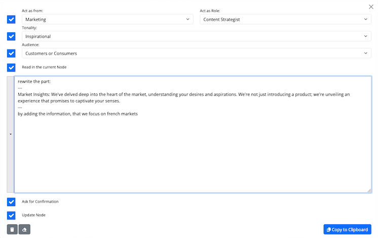

# Conceptmap ChatGPT Plugin V1.2 Update

We're pleased to announce the release of Conceptmap ChatGPT Plugin V1.2. This update brings several new features and improvements to enhance user experience and efficiency.

## Prompt Wizard

- **Roles for Perspective**: Users can now select roles to modify the perspective of the actor, such as viewing a node from the marketing department's viewpoint.
- **Tune the Output**: Adjust the tonality and audience to tailor the output to specific needs.
- **Prompt History**: Access previously used prompts for quick modifications and applications.
- **Integrated Workflow**: The wizard is integrated into the conceptmap node manipulation workflow and is also available as a standalone tool at [Conceptmap Prompt Wizard](https://app.concept-map.com/prompt-wizard).

## Ordering Child Nodes

- **Drag and Drop**: Users can now organize child nodes by dragging them to the desired position (This Feature is currently not supported on Firefox).
- **Sorted Exports**: The order of child nodes will be reflected in HTML exports, ensuring a structured document. Users can set aspect section priorities directly from the root node's edit UI.

## Appending Content

- **Easy Appends**: It's now possible to add content to nodes directly from a ChatGPT chat, ideal for developing longer texts section by section.

## Quality of Life Enhancements

- **Conceptmap History**: Users can navigate through their previous maps with ease.
- **Customizable Aspects**: Modify titles and colors of aspects directly from the root node's edit UI.
- **Feedback Link**: A new link in the plugin allows users to share feedback directly with the developers.
- **Performance Boost**: We've enhanced the loading speed of the root node for extensive maps.
- **Improved Map Generation**: Users can start a new conceptmap with direct topic mentions.

---

**Thank You**

Your feedback has been invaluable in shaping this update. We're committed to continuous improvement of the Conceptmap ChatGPT Plugin. Explore the new features and share your experience.
