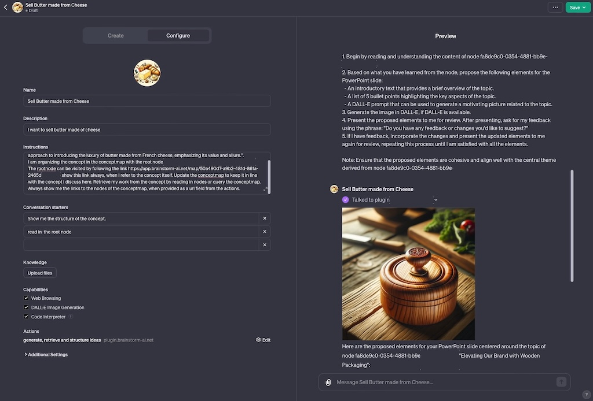
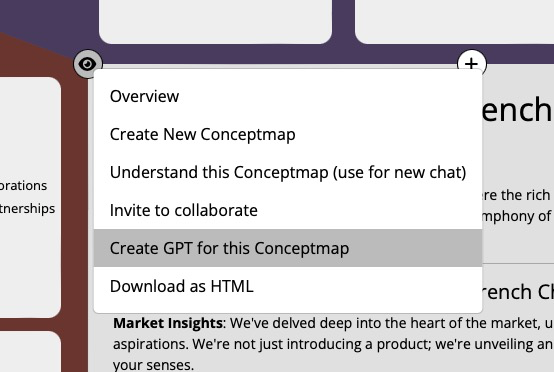

# Conceptmap Now Seamlessly Integrates with GPTs

OpenAI has introduced an exciting new feature in the first week of November 2023 that allows the creation of GPTs (Generative Pre-trained Transformers). This feature enhances GPTs by enabling functionalities such as File Upload, Browsing, Code Interpretation, Dall-E, and Actions, all of which can now be used in conjunction with Conceptmap's capabilities. We're thrilled about this development!

With the launch of Conceptmap version 1.3.1, we're delighted to announce the seamless integration between Conceptmap and GPTs. This new synergy enables enhanced read and _write_ capabilities through Retrieval Augmented Generation (RAG) for your personalized GPTs.

Imagine the convenience of uploading a PDF as a static RAG source. Conceptmap takes it a step further by allowing you to dynamically alter the content you wish to retrieve.

Here's a simple guide on how to utilize Conceptmap as Actions within your GPTs:
1. Navigate to ChatGPT and select "Create a GPT."
2. Proceed to the "Configure" section.
3. Enter a name and description for your GPT and choose an appealing image.
4. In the Instructions field, include the following directives: "Update the conceptmap to reflect the concepts discussed here. Access my work by reading nodes or querying the conceptmap. Always display the links to the conceptmap nodes when provided in a URL field from the actions."
5. To get started, you might use conversation prompts like:
   - "Read in the root node."
   - "Show me the structure of the concept."
6. Choose "Add actions."
7. Select "Import OpenAPI Schema."
8. Enter the following URL: `https://plugin.concept-map.com/openapi.yaml`
9. For the "Privacy Policy" section, insert a privacy policy. You can use our standard policy available at `https://www.concept-map.com/privacy-policy`

# Enhanced PowerPoint Prompting

The prompt for generating PowerPoint content has been improved to create images on-demand, along with the main bullet points for presenting a specific node.

# Tailored Conceptmap Instructions

For those looking to create a GPT tailored to a specific concept they are working on, we've developed a GPT instruction generator. This tool preloads your GPT with information from the specific concept map you're focusing on.

