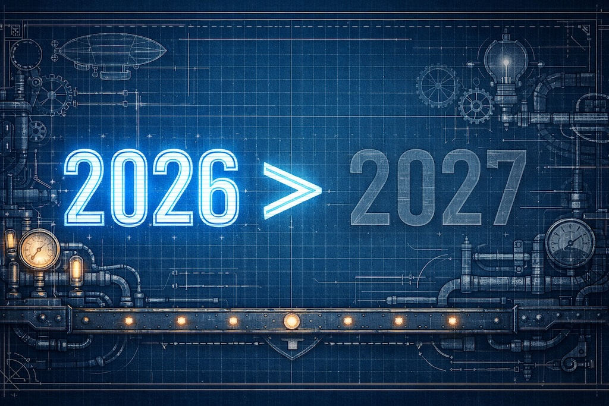
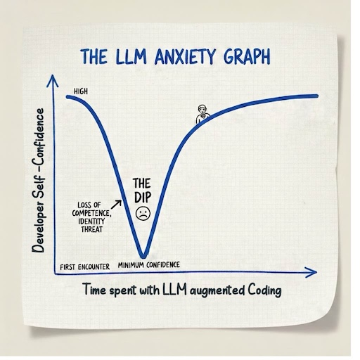

# Why Transforming Software Teams to LLM-Augmented Development in 2026 Is Easier Than in 2027
*The LLM Anxiety Graph and the Cost of Waiting*

By now, 2025 has settled one debate for good: LLM-augmented software development is inevitable.

The question is no longer *if* software teams will work this way, but *when* — and under what conditions. As IT managers, engineering leaders, and architects, our job is no longer to evaluate whether this shift makes sense. Our job is to guide our teams through it without breaking them.

This post argues that 2026 is a significantly better moment to transform software teams than 2027 — not because the tools are weaker, but because the human cost of adaptation is rising rapidly.

To explain why, I use a mental model I call the **LLM Anxiety Graph**.

---

## The LLM Anxiety Graph

Imagine a graph where the x-axis represents time spent working with LLM-augmented development, and the y-axis represents developer self-confidence. Not surface-level nervousness, but something deeper: stress around competence, relevance, and professional identity.

When developers first encounter LLMs, anxiety is usually low. There is curiosity, fascination, maybe skepticism. It feels like learning another tool.

Then comes the moment of realization.

- The LLM writes code that is cleaner than theirs
- It understands APIs they have never used
- It navigates exotic libraries instantly — libraries they would need weeks to ramp up on
- It explains design decisions with unsettling clarity

At that point, **anxiety spikes**.

Only much later—after sustained experience and a painful reframing of what "being a developer" actually means—does anxiety begin to fall again. On the far right side of the graph, many developers eventually reach a new equilibrium, often stronger than before. But the path there is not trivial.

> That dip in the middle is unavoidable. And it is getting deeper and wider every year.

---

## Why the Early Adopters had it Easier

Developers who started using LLM-based coding tools back in 2023 — the GPT-3.5 and early GPT-4 days — had a fundamentally different experience. At that time, LLMs were clearly helpful, but also clearly limited. They were excellent at boilerplate, refactoring, writing unit tests, and cleaning up code. Tools like GitHub Copilot or early Cursor versions boosted productivity, but they did not fundamentally challenge anyone's understanding of what software development was.

Architecture, system design, and deep domain reasoning still felt firmly human. When early adopters lost the ability — or the need — to write boilerplate code by hand, most were perfectly fine with that. It felt like progress, not loss.

Within a few weeks, they had acquired new skills:
- Breaking problems down more explicitly
- Steering the model
- Validating output
- Thinking in terms of intent rather than syntax

Their anxiety dip existed, but it was shallow and short-lived. When much more powerful tools arrived later — tools that clearly operated at a senior-developer level — these early adopters were already on the right-hand side of the graph. They experienced leverage, not fear.

**They had time to adapt gradually. That window is now closed.**

## Why First Contact in 2025 and 2026 Is Different

Developers who are just starting now face a very different situation.

Their first encounter with LLM-augmented development is not a helpful junior assistant. It is a **senior-level architect and developer rolled into one**. It produces solutions they themselves could not write, especially in specialized or exotic domains. There is no gradual ramp-up anymore. The shock happens immediately.

This is where many organizations misjudge what is happening. They interpret resistance as skepticism toward a new tool. In reality, something much deeper is being triggered.

## This Is Not Just Anxiety

Developers are often proud of their coding skills — and they should be. Those skills were earned through years of problem-solving, debugging, refactoring, and building intuition. When an LLM produces beautiful, correct code instantly, it can feel as if that effort has been **devalued retroactively**.

At the same time, developers genuinely love coding. They enjoy the flow, the craft, the feeling of shaping a solution. When the LLM appears to take over the most enjoyable part of the work, the reaction is not rational resistance — it is **grief**.

And for many developers, coding skill is not just something they possess. It is a core part of how they define themselves. When an LLM outperforms them in the very area they identify with, the question becomes existential:

> If this can do what defines me, who am I now?

That is why the dip in the LLM Anxiety Graph is so deep. **It is not about tools. It is about pride, joy, and identity.**

What makes this transition so painful is also what makes it ultimately valuable.

## What Actually Changes — and What Doesn't

There is an important misunderstanding hidden inside the anxiety dip: the feeling that hard-earned skills are being erased.

They are not.

What is happening is not a loss of skill, but a **rebalancing of value**.

Some skills that once consumed a large portion of a developer's time — writing boilerplate, memorizing APIs, manually assembling repetitive structures — are now increasingly handled by LLMs. Those skills are not worthless; they are simply no longer scarce.

At the same time, a different class of skills suddenly becomes far more valuable than before — skills that were always present in good developers, but rarely recognized explicitly.

**These are the skills LLMs amplify, not replace.**

They include the deep understanding of technical systems: knowing how components interact, where complexity accumulates, and where failures will emerge long before they are visible in code. They include the ability to decompose complex problems into meaningful parts, and to recombine solutions into coherent systems. They include guiding problem solving — not by typing faster, but by framing the right questions, constraints, and trade-offs.

They include system thinking, architectural reasoning, and the ability to evaluate whether a solution is correct *in context*, not just syntactically valid. They include understanding *why* something works, where it will break, and what it means for the system as a whole.

These skills are more abstract. They are harder to point to than a clever algorithm or a beautiful code snippet. And that is precisely why they were often underappreciated.

LLM-augmented development changes this.

When the LLM takes over large parts of the mechanical execution, these higher-level skills stop being background noise and become the main source of human value. The developer's role shifts from "writing code" to **orchestrating understanding**—of problems, systems, and solutions.

This is why developers who move through the dip and reach the right-hand side of the graph often report something surprising: not a loss of agency, but a gain. They write less code, but they influence larger systems. They spend less time fighting syntax, and more time shaping intent. Their impact grows, even as their keyboard activity decreases.

> The old skills were not taken away. They were compressed into leverage.

## The Dangerous Misunderstanding: "Let's Just Wait"

For decades, waiting was the correct strategy when new development tools emerged. Early versions were buggy, best practices unclear, documentation missing. Waiting a year usually meant smoother adoption.

But this logic no longer applies.

LLMs do not just improve incrementally. They change character. In 2022, they were helpers. In 2025, they became peers. They did not just get better at their original purpose—they discovered entirely new purposes.

> Waiting does not lead to a more mature, stable tool. It leads to a stronger, more intimidating first encounter.

## Why the Dip Is Getting Deeper and Wider

The anxiety dip today is deeper because first contact already feels like being outperformed. It is wider because every week reveals new capabilities. Just when confidence might stabilize, the LLM demonstrates yet another area of superiority.

Recovery takes longer.

**This is the crucial insight: time does not flatten the curve — it amplifies it.**

## What 2025 Made Clear

The year 2025 removed any remaining illusion that LLM-augmented software development is optional. Competitive pressure, productivity gains, and quality improvements have made the direction irreversible.

That means the role of IT managers and engineering leaders has fundamentally changed. Our task is no longer to decide whether to adopt LLMs. Our task is to **shepherd our teams through an unavoidable identity transformation**.

## Why 2026 Is Better Than 2027

If current trends continue — and there is no reason to believe they won't — LLM-based coding tools will be even more powerful in 2027. First contact will be harsher, the anxiety dip deeper, and the recovery phase longer, all while organizational pressure increases.

Transforming teams in 2026 is already hard. Transforming them in 2027 will be harder.

The dip cannot be avoided. But entering it earlier allows teams to recover earlier, under less pressure, with more psychological safety.

> LLM-augmented development is not a tool migration. It is an identity migration.

And the longer we wait, the more painful that migration becomes.

## Conclusion: The Other Side of the Dip

That is why 2026 is better than 2027 — not because the tools are weaker, but because humans still have a fighting chance to adapt.

The teams that start now will struggle, yes. But they will struggle while the shock is still manageable. They will build new mental models, new skills, and new confidence before the next wave of capabilities arrives.

More importantly: they will reach the other side sooner.

And on that other side, something valuable is waiting. Not diminished developers clinging to relevance, but amplified developers shaping systems at a scale they could not have touched before. The dip is real. The grief is real. But so is the emergence on the far end—where leverage replaces labor, and understanding becomes the currency.

The teams that wait will face a harder transition under more pressure, with less room to breathe. The teams that move now will be the ones who define what software development looks like in the decade ahead.

**The window for graceful adaptation is closing. 2026 is the year to move.**

---

*How is your organization navigating this transition? Are you seeing the anxiety patterns I've described—or perhaps already glimpsing the other side? I'd love to hear how you're helping your teams adapt.*
