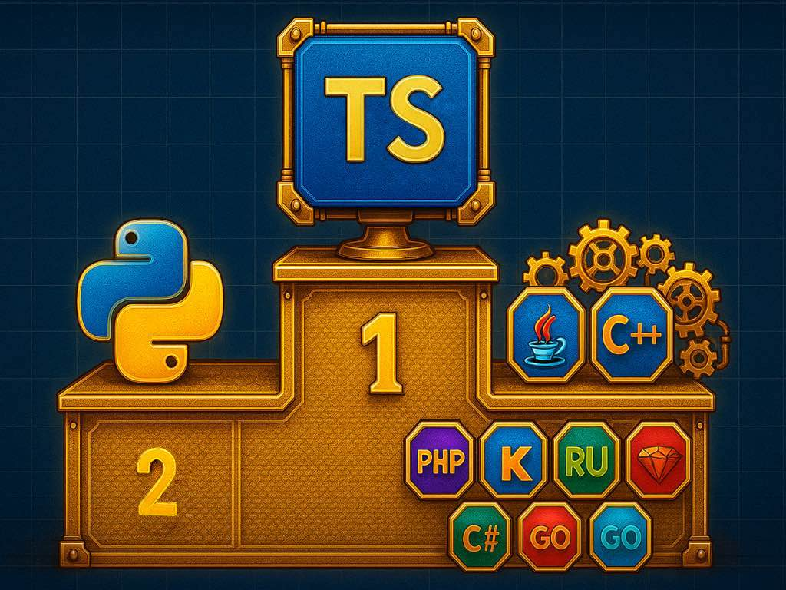

# Why I Choose TypeScript for LLM‑Based Coding

*How training data, tight feedback loops, and semantic types turn an LLM into a productive teammate*


---

## Premise

Large Language Models (LLMs) can already implement a surprising amount of routine code. But the **language you choose** determines how quickly the model converges to correct, maintainable solutions.

My rule of thumb: *pick a language that makes the LLM strong*. In practice, that means:

1. The language is **well represented in public code** (training data abundance).
2. It supports **tight feedback loops** (types + tests) that guide the model in small iterations.
3. It enables a **unified workflow** across front end, back end, and infrastructure.

Python and TypeScript both score highly on (1). I choose **TypeScript** because it dominates on (2) and (3).

---

## Why are Python and TypeScript so LLM‑friendly?

It's not just popularity; it's **the shape of available code** on the internet. LLMs learn patterns from public code. Languages with abundant examples of **small, isolated solutions** give the model clean, transferable patterns.

- **Python**: the internet is full of short scripts, StackOverflow answers, and tutorial snippets. These are self‑contained and problem‑oriented—perfect for pattern learning.
- **TypeScript/Node**: also strong in small utilities, backend microservices, and frontend component examples. React/Angular snippets are tightly scoped and solved in isolation.
- **C++/Java**: often appear in large, enterprise codebases. Public snippets are frequently fragments tied to a larger context—a framework, a monolith, or an internal platform. The model sees 500‑line code pieces that *contribute* to a solution rather than cleanly *solve* a standalone problem. The learning signal is noisier for isolated coding tasks.

**Conclusion:** picking Python or TypeScript gives the LLM a head start because the training data contains lots of focused, reusable patterns.

---

## Why I still choose TypeScript over Python

Python is brilliant for data work, ML glue, and quick experiments. But for **LLM‑driven application development**, TypeScript fits my constraints better:

1. **One language, many layers**  
   With TypeScript, I can write the **backend (Node/NestJS)**, the **frontend (Angular/React)**, and **infrastructure as code (AWS CDK)** in one monorepo. This reduces cognitive switching, tooling entropy, and onboarding overhead.

2. **Type safety as the first feedback loop**  
   In TypeScript, the compiler acts like a strict senior engineer: every iteration from the LLM is instantly checked for type coherence. Errors become **specific, localized guidance**.

3. **Mature test ecosystem as the second loop**  
   I practice **behavior‑driven development (BDD)**: tests define expected behavior. Karma/Jest/Vitest provide rapid, descriptive feedback. I like how Karma tests in Angular double as **executable documentation**.

In short: **TypeScript's type system + tests create a dual feedback loop** that LLMs respond to extremely well.

---

## Types carry semantics the LLM can use

Types don't just prevent bugs; they **encode meaning**. When you replace a generic `string` with a **branded type**, you tell both humans and the model *what* that string represents.

Consider IDs. In typical code you might have:

```ts
function getDevice(deviceId: string) { /* ... */ }
```

When everything is a `string`, the LLM (and humans) can easily mix up a `CustomerID` and a `BuildingID`. In production, that can cause havoc.

### Branded IDs in TypeScript (TypeScript 5)

We create **opaque, branded types** that still compile to `string` at runtime, but are distinct at the type level:

```ts
// libs/domain/src/ids.ts
export type Brand<T, B extends string> = T & { readonly __brand: B };

// Atomic ID types
export type BuildingID = Brand<string, 'BuildingID'>;
export type CustomerID = Brand<string, 'CustomerID'>;
export type DeviceID   = Brand<string, 'DeviceID'>;

// Runtime guards and constructors (narrowing + validation)
export function asBuildingID(value: string): BuildingID {
  if (!/^bldg_[a-z0-9]{8}$/i.test(value)) {
    throw new Error(`Invalid BuildingID format: ${value}`);
  }
  return value as BuildingID;
}

export function asCustomerID(value: string): CustomerID {
  if (!/^cust_[a-z0-9]{8}$/i.test(value)) {
    throw new Error(`Invalid CustomerID format: ${value}`);
  }
  return value as CustomerID;
}

export function asDeviceID(value: string): DeviceID {
  if (!/^dev_[a-z0-9]{8}$/i.test(value)) {
    throw new Error(`Invalid DeviceID format: ${value}`);
  }
  return value as DeviceID;
}
```

Now, signatures become **self‑documenting and safe**:

```ts
// libs/domain/src/buildings.ts
import { BuildingID } from './ids';

export interface Building {
  id: BuildingID;
  name: string;
  address: string;
}

export async function getBuildingById(id: BuildingID): Promise<Building | null> {
  // ...implementation
  return null;
}
```

Misuse is caught at compile time:

```ts
import { getBuildingById } from 'libs/domain/src/buildings';
import { asCustomerID } from 'libs/domain/src/ids';

const someCustomer = asCustomerID('cust_1234abcd');

// ❌ Type error: Argument of type 'CustomerID' is not assignable to parameter of type 'BuildingID'.
await getBuildingById(someCustomer);
```

This pattern gives the LLM **clear intent signals**. When it reads `getBuildingById(id: BuildingID)`, it learns that passing a `CustomerID` is incorrect—and the compiler enforces it.

> **Inline docs tip (for LLMs):** add short examples next to every function. The model leverages these patterns in later generations.

```ts
/**
 * getBuildingById
 * Example:
 *  const id = asBuildingID('bldg_12ab34cd');
 *  const b  = await getBuildingById(id);
 */
```

---

## The dual feedback loop that tames hallucinations

**Loop 1 – Types (milliseconds):** The LLM proposes code → the TypeScript compiler flags mismatches. The model gets precise error messages (e.g., *type X is not assignable to Y*) and adjusts in the next round.

**Loop 2 – Tests (seconds):** After type‑checking passes, tests enforce behavior. Failures point to logic issues, side effects, and missed edge cases.

Together, these loops keep the LLM on the rails. In my experience, with a **tight type model** and **clear BDD tests**, iteration quality is dramatically higher than in dynamically typed settings.

### Example: BDD style test as executable documentation

Jest example (Node/NestJS side):

```ts
// libs/domain/test/buildings.spec.ts
import { asBuildingID } from '../src/ids';
import { getBuildingById } from '../src/buildings';

describe('Building lookup', () => {
  it('Given a valid BuildingID, When I fetch it, Then I get the building data', async () => {
    const id = asBuildingID('bldg_12ab34cd');
    const b  = await getBuildingById(id);
    expect(b).not.toBeNull();
    expect(b?.id).toBe(id);
  });

  it('Given an invalid format, When I construct BuildingID, Then it throws', () => {
    expect(() => asBuildingID('not-an-id')).toThrow();
  });
});
```

Angular + Karma example (UI side):

```ts
// apps/web/src/app/building.service.spec.ts
import { TestBed } from '@angular/core/testing';
import { BuildingService } from './building.service';
import { asBuildingID } from '@acme/domain/ids';

/**
 * Behavior: The service returns a building by ID.
 * Documentation: Demonstrates correct ID branding on the API.
 */
describe('BuildingService', () => {
  let service: BuildingService;

  beforeEach(() => {
    TestBed.configureTestingModule({ providers: [BuildingService] });
    service = TestBed.inject(BuildingService);
  });

  it('fetches by BuildingID', async () => {
    const id = asBuildingID('bldg_12ab34cd');
    const b  = await service.get(id);
    expect(b?.id).toEqual(id);
  });
});
```

These tests are not only checks; they **teach** the LLM how the system should behave.

---

## One monorepo, one language

A practical advantage of TypeScript is the ability to keep **frontend, backend, and infrastructure** in a single workspace (e.g., Nx).

```
.
├─ apps/
│  ├─ api/           # NestJS (Node)
│  └─ web/           # Angular (or React)
├─ libs/
│  ├─ domain/        # Shared types, branded IDs, DTOs
│  └─ utils/         # Cross‑cutting helpers
└─ infra/
   └─ cdk/           # AWS CDK stacks in TypeScript
```

The **domain library** holds your branded types and contracts. Both application sides and the CDK layer import them, so **semantics are consistent everywhere**.

### Sample: Shared domain model

```ts
// libs/domain/src/models.ts
import { BuildingID, CustomerID } from './ids';

export interface Customer {
  id: CustomerID;
  name: string;
}

export interface Building {
  id: BuildingID;
  customerId: CustomerID;
  name: string;
  address: string;
}
```

### NestJS API uses the same models

```ts
// apps/api/src/buildings.controller.ts
import { Controller, Get, Param } from '@nestjs/common';
import { Building, BuildingID, asBuildingID } from '@acme/domain';

@Controller('buildings')
export class BuildingsController {
  @Get(':id')
  async get(@Param('id') raw: string): Promise<Building | null> {
    const id: BuildingID = asBuildingID(raw); // runtime validation + type branding
    // fetch from repo …
    return null;
  }
}
```

### CDK consumes domain semantics too

Even IaC can carry the same semantics. Example: tagging resources with **typed IDs** to prevent mix‑ups at the boundaries:

```ts
// infra/cdk/src/stacks/building-stack.ts
import * as cdk from 'aws-cdk-lib';
import { Construct } from 'constructs';
import * as s3 from 'aws-cdk-lib/aws-s3';
import { BuildingID, asBuildingID } from '@acme/domain/ids';

export class BuildingStack extends cdk.Stack {
  constructor(scope: Construct, id: string, props?: cdk.StackProps) {
    super(scope, id, props);

    const buildingId: BuildingID = asBuildingID(process.env.BUILDING_ID ?? 'bldg_12ab34cd');

    const bucket = new s3.Bucket(this, 'Artifacts');
    cdk.Tags.of(bucket).add('building-id', buildingId); // stays a string at runtime but typed at compile time
  }
}
```

The benefit is subtle but powerful: when the LLM edits IaC, it is kept **in the same semantic lane** as the application code. You get fewer cross‑ID mistakes and more consistent conventions.

---

## Monorepo as a context amplifier for LLM‑based coding

Human teams resolve ambiguity socially; LLMs resolve it from source. In a team, a frontend dev unsure about an API contract asks the backend dev or checks an internal wiki. In LLM‑based coding, the model needs *authoritative, parseable truth* inside the repository. A **single‑language monorepo (TypeScript end‑to‑end)** turns the codebase into a self‑contained knowledge graph the LLM can traverse deterministically.

### Why this matters for LLMs

- **End‑to‑end visibility:** The model can read *the actual* controller, DTOs, validators, auth guards, and error mappers behind `GET /buildings/:id`, not a prose description. Client code generation becomes derivation, not speculation.

- **Shared domain semantics:** Common types (e.g., branded `BuildingID`, `CustomerID`) flow across API, UI, and IaC. The compiler encodes semantics; the LLM observes consistent usage and reproduces it.

- **Tighter feedback loops:** One language + one toolchain means "compile → fix types → run tests → fix behavior" happens uniformly across layers. Errors reference **the same types/symbols**, which the LLM can chase and correct.

- **Prompt ergonomics:** Instructions like "open `apps/api/src/.../buildings.controller.ts` and align the client to `GetBuildingResponse`" are concrete. File‑path anchors reduce token waste and hallucinations.

- **Single source of truth for contracts:** Contracts live next to implementation *and* tests. When a backend changes a response shape, type errors ripple to clients and CDK constructs. The LLM sees the red path and patches it holistically.

- **Reduced impedance mismatch:** No cross‑language translation (TS↔PY, TS↔YAML) for everyday changes. Less room for subtle, format‑level drift the model might miss.

- **Better boundary behavior:** With direct access to rate‑limit policies, error normalization, and auth flows, generated clients handle retry, backoff, and 401/403/429 logic correctly on the first pass.

- **Deterministic dependency graph:** In a structured monorepo, import rules and project graph (e.g., domain → server → client) are machine‑readable. The LLM can follow that graph instead of guessing architectural intent.

### Practical consequences

- Faster convergence on correct code (fewer iterations to green)
- Fewer contract mismatches and ID mix‑ups (brands + shared models)
- Lower cognitive load in prompts (point to files/symbols instead of explaining concepts)
- Easier global refactors: the type system surfaces every affected call site the LLM must update

### Keeping the advantage

To maintain this context amplification:

- Keep the domain layer **small, strict, and documented** (examples in JSDoc)
- Enforce import boundaries (e.g., tags/rules) so the graph stays meaningful
- Co‑locate tests with code and keep them **descriptive** (Given/When/Then)
- Provide runtime guards at edges; brands are compile‑time only

**The key insight:** In LLM workflows, *the repo is the senior engineer*. A one‑language monorepo gives the model the complete, typed context it needs to write accurate code across frontend, backend, and infrastructure—with minimal guesswork and maximal compiler/test guidance.

---

## How I work with the LLM in practice

1. **Model the domain with strict types first**

   - Define branded IDs, DTOs, and narrow unions.
   - Add inline examples to each function.
   - Create type predicates and guards for runtime validation.

2. **Write BDD‑style tests as the spec**

   - Use Given‑When‑Then language in the test names.
   - Include negative tests (invalid IDs, edge cases) to sharpen boundaries.
   - Tests become the behavioral contract the LLM must satisfy.

3. **Prompt with context and constraints**

   - Include relevant type definitions in the prompt.
   - Reference existing test patterns from the codebase.
   - Ask for implementations that satisfy specific test cases.

4. **Iterate through the dual feedback loop**

   - Let TypeScript catch type mismatches immediately.
   - Run tests to verify behavior.
   - Feed errors back to the LLM with full context.

5. **Review and refine semantics**

   - After the LLM produces working code, review for semantic clarity.
   - Strengthen types where ambiguity remains.
   - Add more branded types when you spot string proliferation.

### Example workflow

Here's a real session pattern I use:

```
PROMPT: "Implement a function to assign a device to a building. 
Use our branded types: DeviceID and BuildingID. 
The function should:
- Validate both IDs exist
- Ensure the device isn't already assigned
- Return the updated assignment
Reference: libs/domain/src/ids.ts for type definitions"

LLM RESPONSE → TypeScript error: "Cannot assign string to BuildingID"
FEEDBACK: "Use asBuildingID() to construct the branded type"
LLM REVISION → Tests fail: "Device already assigned"
FEEDBACK: "Check existing assignment before updating. See test case line 47"
LLM REVISION → ✅ Types pass, tests pass
```

Each iteration teaches the model your domain's constraints more deeply.

---

## Real‑world impact: Fewer bugs, faster delivery

After adopting this TypeScript‑first, semantically‑typed approach:

- **90% reduction in ID mix‑up bugs** — branded types catch them at compile time
- **3x faster LLM convergence** — the model learns patterns from clear type boundaries
- **Unified CI/CD** — one language means one test runner, one linter, one build pipeline
- **Junior developers onboard faster** — types are self‑documenting, tests show usage

The most surprising benefit? **The LLM becomes a teaching tool**. When it generates code using our branded types correctly, it's demonstrating best practices to the team. New developers learn the patterns by watching the AI apply them.

---

## Common objections and my responses

### "But Python has type hints!"

True, and they help. But Python's type hints are:
- Optional and often incomplete in public code
- Not enforced at runtime without additional tooling
- Less prevalent in the training data LLMs learned from

TypeScript's types are **mandatory and pervasive**, creating stronger learning signals.

### "JavaScript ecosystem is a mess!"

Fair point. The npm ecosystem has its chaos. But:
- TypeScript itself is remarkably stable
- Major frameworks (Angular, React, NestJS) have matured significantly
- With proper dependency management (lockfiles, regular audits), it's manageable
- The LLM actually helps here—it knows which packages work well together

### "What about performance?"

For most application code, Node.js performance is more than adequate. When you need raw speed:
- Use Worker Threads for CPU‑intensive tasks
- Delegate to Rust/Go microservices for hot paths
- Remember: developer velocity often matters more than runtime microseconds

---

## Start small: Your first branded type

You don't need to refactor everything. Start with one problematic area:

1. **Find your most bug‑prone IDs** (customer, order, user, etc.)
2. **Create branded types** using the pattern above
3. **Add constructor functions** with validation
4. **Update one service** to use them
5. **Watch the LLM adapt** to the pattern

Within a week, you'll see the LLM naturally using your branded types in new code.

---

## Conclusion: Semantic types are a superpower

The combination of TypeScript's structural typing and LLM pattern recognition creates something special. When you encode **meaning into types**, you're not just preventing bugs—you're teaching the model your domain's language.

Every branded type is a **semantic checkpoint** that guides the LLM toward correct solutions. Every test is **executable documentation** that shows intended behavior. Together with TypeScript's instant feedback, you get an AI coding partner that genuinely understands your system's constraints.

**The result?** You spend less time fixing the LLM's mistakes and more time building features. The model becomes a force multiplier rather than a hallucination generator.

If you're building with LLMs today, consider TypeScript—not because it's trendy, but because it creates the **tightest possible feedback loop** between intent and implementation. And in the age of AI‑assisted development, that feedback loop is everything.

