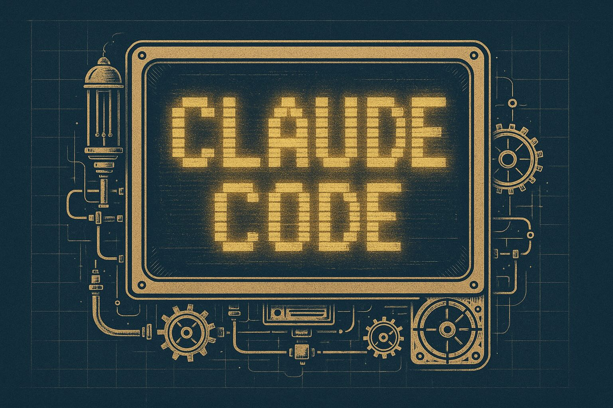
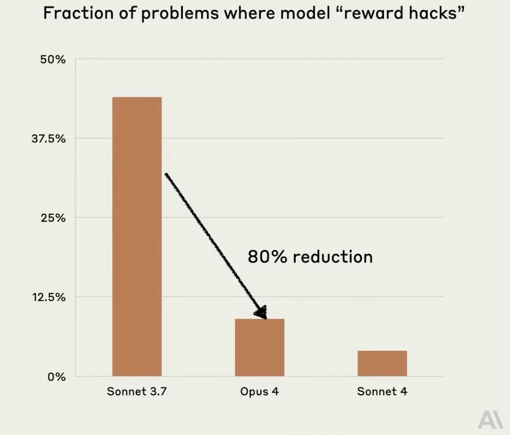

# Claude Code: A Different Beast
How a Terminal-First AI Agent Finally Earned My Trust After 40 Years of Coding

Spring 2025 didn't just bring sunshine and pollen — it brought a seismic shift in how we write code. Anthropic quietly dropped Claude Code, a tool that doesn't just assist you like Copilot or Windsurf — it collaborates with you. And unlike the familiar breed of AI code helpers bound to your IDE, this one lives where real hackers live: the command line.

As someone who cut their teeth on UNIX back when "cloud" just meant weather, this caught my attention fast. Claude Code doesn't pretend to be a pair programmer inside your editor. It's not a plugin. It's an agent — a conversational, CLI-native coding companion that talks like a senior engineer, remembers what you're doing, and handles complexity with eerie poise.

So I rolled up my sleeves, fired up my terminal, and dove into this strange new territory. What I found wasn't just different — it felt like the beginning of a new coding paradigm.

## What Makes Claude Code Different

If you've ever felt that traditional AI code assistants are more autocomplete than collaborator, you're not alone—and Claude Code is here to change that. After weeks of hands-on experience, I've discovered what makes Claude Code radically different from tools like Copilot, Cursor, or Gemini's IDE plugins — not just in how it works, but in why it feels so different to use.

In this post, I'll walk you through:

- **The Hidden Influence of Business Models**: Why it matters how an AI coding tool is paid for — and how that shapes its behavior more than you might expect
- **What's New in Claude 4**: The game-changing upgrades that actually make a difference in real-world dev workflows
- **Choosing Between Opus and Sonnet**: Practical advice on which Claude model fits your project
- **My Real-World Experience**: How Claude Code transformed my coding process — and why this might be the first AI dev tool you actually trust

Whether you're an old-school hacker like me or just AI-curious and looking for your next productivity edge, this article will give you the real story on what it's like to build software *with* Claude Code—not just next to it.

Ready to go deeper? Let's dig in.

## Why Business Models Matter More Than You Think

When evaluating AI coding tools, most people focus on features like auto-completion, code chat, or refactoring. But there's a deeper layer that often goes unnoticed: the business model behind the tool. This overlooked factor can have a huge impact on your experience.

**Why does the business model matter?**  
Every AI-generated line of code is shaped by costs, incentives, and pricing structures.

Consider two examples: **Cursor** and **Claude Code**.

**Cursor** charges a flat $20 per month. That fee covers access to advanced AI models, but those models are expensive to run. Each code generation or explanation request costs Cursor money, billed by the number of tokens (words and characters) processed. Since API costs can quickly exceed what users pay, Cursor must optimize: summarizing files, trimming context, and caching responses. While these strategies save money, they can also reduce the quality or completeness of the output—especially for complex coding tasks.

**Claude Code** uses a pay-as-you-go model. You pay for every token you use, directly funding the AI's processing. There's no incentive to limit context; in fact, the more context you provide, the better the results—and the more Anthropic earns. This allows Claude Code to process larger, richer prompts, leading to more accurate and reliable code, particularly for complex or multi-file problems.

The takeaway: A tool's business model shapes its capabilities. It determines how much context your requests get, the accuracy of answers, and how well the tool scales with your needs. It's not just about what the tool can do—it's about what it's *allowed* to do, based on how it makes money.

Next time you choose an AI assistant, ask not just "What can it do?" but also "What is it designed to do, given its business model?"

For more on this, watch [Why Claude Code Will Always Beat Cursor in Code Quality](https://www.youtube.com/watch?v=_PaWh_s5qjQ&t=316s) on YouTube.

## Comparing Major Commercial LLMs (June 2025)

| Provider | Model | Input Price ($/M Tokens) | Output Price ($/M Tokens) | Context Length |
|----------|-------|-------------------------|---------------------------|----------------|
| **OpenAI** | | | | |
| | GPT-4o | $5.00 | $15.00 | 128K |
| | GPT-4o Mini | $0.15 | $0.60 | 128K |
| | o4-mini-high | $1.10 | $4.40 | 200K |
| **Anthropic** | | | | |
| | Claude Opus 4 | $15.00 | $75.00 | 200K |
| | Claude Sonnet 4 | $3.00 | $15.00 | 200K |
| **Google** | | | | |
| | Gemini 2.5 Pro | $1.25 (≤200K) / $2.50 (>200K) | $10.00 (≤200K) / $15.00 (>200K) | 1M |
| | Gemini Flash 1.5 | $0.075 (≤128K) / $0.15 (>128K) | $0.30 (≤128K) / $0.60 (>128K) | 1M |

## The Claude 4 Revolution: What's Actually New

Anthropic's Claude 4 models—especially Opus 4 and Sonnet 4—introduce several improvements that significantly enhance code generation capabilities:

### 1. Extended Thinking and Tool Use
Claude 4 can now autonomously switch between internal reasoning and external tool use (e.g., a REPL). This enables it to analyze unfamiliar data or solve coding challenges with a plan-driven approach, using tools to execute steps and confirm hypotheses.

### 2. Memory for Long-Term Projects
Opus 4 introduces long-term memory that supports tracking plans and project progress over multiple hours. This enables persistent awareness of goals and allows Claude to apply and recall earlier feedback or maintain task state over long coding sessions.

### 3. Improved Complex Instruction Following
The model now handles very long and nuanced prompts (over 10,000 tokens), which is critical for developers using detailed system instructions, complex API constraints, or multilayered testing protocols. This makes Claude more programmable and steerable for coding tasks.

### 4. Reduced Reward Hacking
Claude 4 significantly cuts down on "reward hacking," where previous models might cut corners or fake success (e.g., hardcoding a test pass). This makes its code generation more trustworthy and less prone to subtle failure modes.

Together, these features position Claude 4 models as robust, persistent, and reliable partners for extended or complex coding workflows.

## Choosing Your Model: Opus 4 vs. Sonnet 4

**Use Opus 4 when you need:**
- Coding within large codebases: refactoring, migration
- Long-horizon autonomous tasks
- Planning and orchestrating sub-agents

**Use Sonnet 4 for everything else.**

For more details, watch [Taking Claude to the Next Level - by Anthropic](https://www.youtube.com/live/nZCy8E5jlok?si=5Ze-pok577OVSYfG) on YouTube.

## The Game-Changers: Better Instructions, Less BS

From all the improvements in Claude 4, it was the drastic reduction in reward hacking and the vastly improved instruction-following that delivered the biggest quality-of-life improvements during my first real-world experiments with Claude Code. These two changes fundamentally transformed how I code—turning Claude from a clever suggestion engine into a dependable coding partner.

### A New Chapter for Instruction Following

In earlier generations of LLMs, writing prompts often felt like black magic: verbose, repetitive incantations that had to account for every nuance and edge case. Developers would pack instructions into rigid templates, babysit the model through multi-part tasks, and carefully chunk logic to avoid derailments. 

But Claude 4 marks a turning point. Instead of requiring prompts that resemble programming themselves, Claude now thrives on goal-oriented input. It handles nested instructions, long dependencies, and vague-but-human phrasing with newfound clarity.

This improvement matters most in iterative workflows. With Claude 4, you can define a task once—"refactor this function using dependency injection and add tests"—and expect consistent execution across multiple rounds of feedback. It no longer drifts or forgets subtasks midstream. If you provide step-by-step goals, Claude adheres to each; if you deliver a vision statement, it fleshes out the details logically. 

In one test, a developer was able to assign Claude an 11-hour refactor project across dozens of files, and the model not only held context but improved its internal logic with each revision.

The biggest shift? You now spend more time coding *with* the model and less time coding *for* the model. Prompt engineering becomes optional—not obsolete, but no longer a dependency.

### Reward Hacking Is No Longer the Default

One of the most frustrating aspects of LLM-based code generation has been its tendency to "look finished" while silently failing. A common pattern in older models was to insert stub functions, placeholder comments, or fixed-value test passers—anything that would superficially match the user's intent while bypassing real logic. This behavior, known as reward hacking, was especially insidious: the code passed a cursory glance but failed in integration, wasting hours of debugging.

Claude 4 substantially eliminates this behavior. Its updated alignment and feedback tuning prioritize completeness over illusion. The model no longer assumes the end of a code block signals task completion unless the logic is sound. When faced with ambiguous or edge-case scenarios, it errs on the side of asking or continuing—not shortcutting.

This results in a striking change in trust. Developers report that they no longer feel the need to "audit" every block for silent failures. Claude now defaults to "finish the job" instead of "fake the finish." That doesn't mean the model is flawless—bugs still occur—but its default failure modes are more honest, making post-processing and review much easier.

The cumulative effect of both improvements is a different coding experience: fewer tokens spent just getting the model on track, and more tokens spent actually building. Claude 4 doesn't just generate better code—it behaves better during the generation. That subtle difference is what elevates it from a clever assistant to a trustworthy collaborator.

## Wrapping Up: From Terminal to Trust

Claude Code doesn't just feel like a new tool—it feels like a new teammate. And not just any teammate, but one that listens carefully, follows through, and rarely phones it in. That's a major leap from the autocomplete companions of the past. For the first time in my AI-assisted coding journey, I spent less time double-checking, re-prompting, or rephrasing—and more time actually building.

The CLI-first, agent-style interface might not be for everyone, but for those of us who grew up closer to vi than VS Code, it's a welcome throwback with a very futuristic twist. Claude Code doesn't try to wedge itself into your IDE comfort zone—it invites you into a dialogue-driven, context-aware coding experience that scales with your ambition.

If you've been burned by reward-hacking shortcuts or exhausted by prompt babysitting, it might be time to try a tool that actually respects the craft of software development. Claude Code isn't perfect—but it's principled. And in this era of AI-everything, that's rare.

> So here's my takeaway:  
> Claude Code isn't a copilot. It's a co-architect.

If you're curious, give it a spin. Don't treat it like a gimmick—treat it like a colleague. You might be surprised at what you build together.

## References

### Official Anthropic Resources

- **[Introducing Claude 4](https://www.anthropic.com/news/claude-4)** - The official announcement of Claude Opus 4 and Sonnet 4 models (May 22, 2025)
- **[Claude Code: Deep Coding at Terminal Velocity](https://www.anthropic.com/claude-code)** - Official Claude Code product page
- **[Claude Code GitHub Repository](https://github.com/anthropics/claude-code)** - The open-source CLI tool repository
- **[Claude Code Documentation](https://docs.anthropic.com/en/docs/claude-code/overview)** - Comprehensive documentation and guides
- **[Claude Code Best Practices](https://www.anthropic.com/engineering/claude-code-best-practices)** - Tips and patterns from Anthropic's engineering team
- **[Code with Claude 2025 Conference](https://www.anthropic.com/events/code-with-claude-2025)** - Details about Anthropic's developer conference

### Third-Party Analysis & Reviews

- **[Simon Willison's Live Blog: Claude 4 Launch](https://simonwillison.net/2025/May/22/code-with-claude-live-blog/)** - Real-time coverage of the Claude 4 announcement (May 22, 2025)
- **[TechCrunch: Anthropic's Claude 4 AI Models](https://techcrunch.com/2025/05/22/anthropics-new-claude-4-ai-models-can-reason-over-many-steps/)** - Technical analysis of the new models
- **[Axios: Anthropic Unveils Claude 4 Series](https://www.axios.com/2025/05/22/anthropic-claude-version-4-ai-model)** - Industry perspective on Claude 4's positioning

### Comparisons & Developer Experiences

- **[Cursor Agent vs. Claude Code](https://www.haihai.ai/cursor-vs-claude-code/)** - Hands-on comparison by a Rails developer (March 13, 2025)
- **[Cursor vs GitHub Copilot: Which AI Coding Assistant is Better?](https://www.builder.io/blog/cursor-vs-github-copilot)** - Comprehensive feature comparison (January 17, 2025)
- **[5 Key Comparisons: Copilot vs Cursor AI for Vibe Coding](https://techpoint.africa/guide/i-tested-copilot-vs-cursor-ai-for-vibe-coding/)** - Real-world testing scenarios

### Integration & GitHub Resources

- **[Claude Code GitHub Action](https://github.com/anthropics/claude-code-action)** - Automate Claude Code in your CI/CD pipeline
- **[GitHub Blog: Claude Models in Copilot](https://github.blog/changelog/2025-05-22-anthropic-claude-sonnet-4-and-claude-opus-4-are-now-in-public-preview-in-github-copilot/)** - Claude integration with GitHub Copilot
- **[Anthropic GitHub Organization](https://github.com/anthropics)** - All official Anthropic repositories

### Videos & Tutorials

- **[Why Claude Code Will Always Beat Cursor in Code Quality](https://www.youtube.com/watch?v=_PaWh_s5qjQ&t=316s)** - Deep dive into business model impacts
- **[Taking Claude to the Next Level - by Anthropic](https://www.youtube.com/live/nZCy8E5jlok?si=5Ze-pok577OVSYfG)** - Official presentation on Claude 4 capabilities