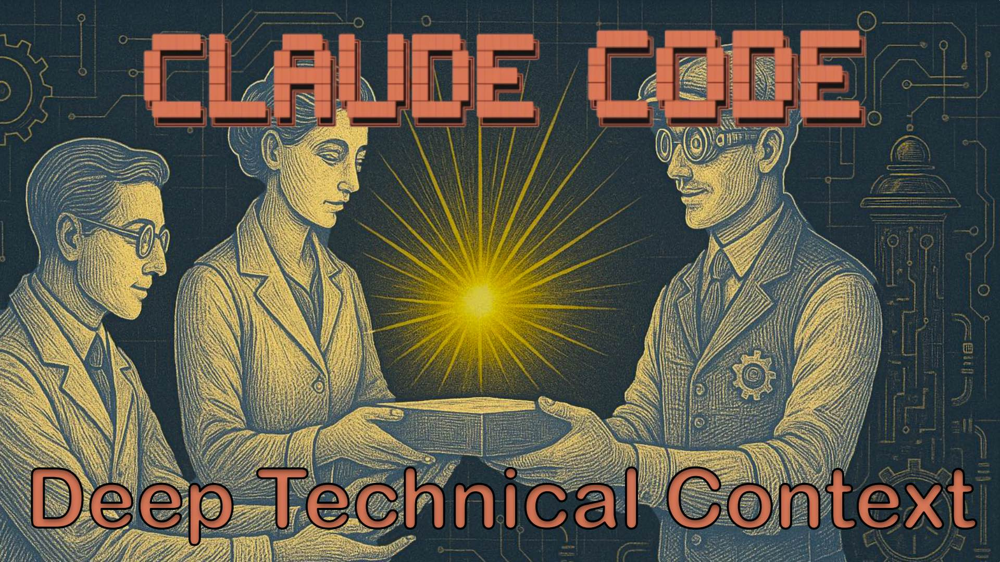

# Context Engineering for Claude Code: Mastering Deep Technical Knowledge

From Hallucinations to High Fidelity: The Power of Purpose-Built Knowledge



After spending considerable time with Claude Code, I've come to a crucial realization: success with AI coding assistants is fundamentally about **context engineering**. It's not just about asking the right questions—it's about providing the right knowledge foundation.

## The Three Pillars of Context Engineering

In my projects, I've identified three essential components for effective AI-assisted development:

**a) Project Architecture Knowledge**  
Understanding of class hierarchies, libraries, frameworks, and design patterns specific to your codebase. Mostly stored in the `CLAUDE` files.

**b) Product Requirements Documentation**  
Clear specifications of what the product should do, gathered through user stories, requirement engineering, and customer interviews. Stored in `*.prd.md` files in the components directories.

**c) Deep Technical Knowledge**  
Specialized understanding of core technologies, mathematical concepts, algorithms, and critical middleware components.

Today, I want to focus on that third pillar—and share a game-changing approach I've discovered for engineering this crucial part of the context.

## 1. The Research Revolution: Creating Knowledge Files That Transform AI Performance

Modern LLMs like GPT-4 and Claude have impressive general knowledge, but they hit walls when dealing with specialized technologies, recent updates, or complex technical implementations. This is where research tools come in.

I've developed a workflow using OpenAI's "Deep Research" and Anthropic's "Research" functionality to create comprehensive knowledge documents that dramatically improve AI coding assistance. These aren't just summaries—they're carefully crafted technical references that capture nuanced details LLMs typically miss or hallucinate about.

The impact? Tasks that previously resulted in confused implementations now produce production-ready code. The difference is like giving your AI assistant a PhD in your specific technology stack.

## 2. Real-World Example: Mastering Eclipse Ditto

Let me walk you through a concrete example that transformed my development workflow. We rely heavily on Eclipse Ditto, an elegant open-source digital twin solution. While GPT-4 and Claude know the basics, our implementation pushed into advanced territory where AI assistants started to struggle:

- **Complex Ditto policies** for fine-grained access control
- **Web of Things (WoT) Thing Models** for standardized device descriptions  
- **Extensive RQL (Resource Query Language)** for sophisticated data queries

When I asked standard coding questions about these features, the AI assistants would confidently provide solutions—that were subtly wrong. The hallucinations were particularly dangerous because they *seemed* plausible. Functions that didn't exist, syntax that looked right but wasn't, architectural patterns that would work in theory but fail in production.

### My Solution: The Research-Driven Knowledge Document

Here's the workflow that changed everything:

**Step 1: Initial Deep Research with OpenAI**  
I prompted: "Research Eclipse Ditto's advanced features including policy management, WoT Thing Models integration, and RQL query syntax. Focus on implementation details, best practices, and common pitfalls."

Result: A comprehensive analysis with code examples, architectural diagrams, and gotchas I'd never have discovered on my own.

**Step 2: Refinement with Claude Research**  
I fed the OpenAI output to Claude with: "Based on this initial research document, validate the technical details, find any gaps, and add practical implementation examples for Eclipse Ditto policies, WoT models, and RQL queries. Focus on production-ready patterns."

Result: Claude identified three outdated patterns, added five real-world examples, and integrated insights from recent GitHub issues.

**Step 3: Creating the Master Context**  
The combined document became `ditto-advanced-knowledge.md` in my project. Now, whenever I work on Ditto features, this context transforms my AI assistant from a confused junior developer into a knowledgeable architect. In Claude Code, priming the context is beautifully simple: just prompt: `Read @ditto-advanced-knowledge.md and understand`.

The payoff? Features that previously took days of trial-and-error now ship in hours. The AI suggests optimizations I wouldn't have thought of. Most importantly, it *understands* our specific use case rather than giving generic advice.

### Critical Best Practices I've Learned
#### 1. Always Review Your Knowledge Files
Hallucinations in knowledge documents are catastrophic—they compound with every use. After generating any knowledge file, I thoroughly review and tweak it myself and, even better, have our domain expert validate it. One incorrect API pattern in your knowledge file means every future implementation will be wrong.

#### 2. Manage Context Wisely
When knowledge files grow beyond 50KB (~12k token), you risk exhausting context tokens before actual coding begins. My solution: split them strategically:

* `ditto-advanced-knowledge-policies.md` (access control patterns)
* `ditto-advanced-knowledge-wot.md` (Thing Model implementations)
* `ditto-advanced-knowledge-rql.md` (query language reference)

This way, I only load what's relevant. After all, I rarely need WoT models when crafting RQL queries.

#### 3. Monitor Your Token Usage
Before importing knowledge files, I often run `/compact` or even `/clear` to maximize available context. Watch for Claude Code's "Compacting context" message—it's actively discarding your carefully curated knowledge. When this happens, reload the knowledge file.

#### 4. Evolve Your Knowledge Files with Real Implementations
After weeks of development, I've discovered a powerful pattern: enriching knowledge files with references to working code. For example, in my Ditto knowledge file, I'll add:
```markdown
For production-ready policy implementation, see @src/policies/DeviceAccessPolicy.cpp
For complex RQL query patterns, see @src/queries/TimeSeriesAggregation.cpp
```
Claude Code can follow these references to examine actual working examples from your codebase. This creates a powerful feedback loop—your knowledge files become living documents that grow smarter with every successful implementation.
The trade-off? These enhanced knowledge files become project-specific. While the base technical knowledge remains transferable, the code references tie them to your particular codebase. I maintain two versions: a "pure" knowledge file for sharing across projects and an "enhanced" version with implementation references for maximum effectiveness within each project.

These practices transform knowledge files from static documents into dynamic tools that evolve with your project.

## 3. Why Can't Claude Code Research On-Demand?

You might wonder: "Why not let Claude Code do the research when problems arise?" The answer comes down to one word: **tokens**.

Research algorithms are token-intensive operations. Consider what happens during a single research session:
- Queries to hundreds of current articles and documentation pages
- Processing massive amounts of text to extract relevant information
- Multiple refinement passes to synthesize findings
- Generation of comprehensive, citation-backed outputs

A typical research session consumes 100,000+ tokens and costs $40-70. When you're in the flow of development, you can't afford to wait 5-30 minutes and burn through your token budget every time you hit a knowledge gap.

By front-loading this research into reusable knowledge documents, you get the best of both worlds: deep, accurate technical knowledge available instantly at a fraction of the cost. It's the difference between having a technical expert on speed dial versus sending them on a research expedition every time you have a question.

## 4. Under the Hood: How Research Tools Work

### 4.1 OpenAI Deep Research

OpenAI's Deep Research, launched in February 2025 [1], represents a breakthrough in AI-powered autonomous research. It transforms how we gather technical knowledge, moving from simple searches to comprehensive investigations that rival human researchers.

**The O3 Model Foundation**  
Deep Research runs on a specialized o3 model variant with approximately 200 billion parameters. This architecture introduces capabilities that fundamentally change what's possible:
- **Simulated reasoning**: The model actually "thinks" before responding, pausing to reflect on its analysis
- **Test-time compute scaling**: Allocates more computational resources for harder problems—like a human taking more time on complex questions
- **Extended context**: Processes up to 200,000 tokens (roughly 150,000 words), enabling analysis of entire codebases or documentation sets

The results speak for themselves: Deep Research achieves 26.6% accuracy on the "Humanity's Last Exam" benchmark—a test so difficult that previous AI systems topped out at 9% [1].

**Sequential Multi-Agent Pipeline**  
Deep Research orchestrates six specialized agents in a carefully designed sequence [2]:
1. **Triage Agent**: Analyzes query complexity and routes appropriately
2. **Clarification Agent**: Refines ambiguous requests
3. **Instruction Builder**: Creates detailed research plans
4. **Research Agent** (o3-deep-research): Executes the investigation
5. **Web Grounding Agent**: Interfaces with Bing Search and renders JavaScript-heavy sites
6. **Report Generation Engine**: Produces 25-36 page reports with 100+ citations

**The Infrastructure Reality**  
Here's what makes this impractical for real-time use: Each Deep Research session requires:
- Minimum 8 A100 GPUs ($24/hour for the cluster)
- 7-30 minutes processing time (sometimes days for complex queries)
- $40-70 in token costs per comprehensive research session
- Energy consumption up to 40 watt-hours per query

This computational intensity—running 1000x slower than standard ChatGPT—is precisely why pre-computing knowledge documents isn't just smart, it's essential [10].

### 4.2 Claude Research (Anthropic)

Claude Research takes a radically different approach—prioritizing speed and integration over exhaustive depth. Launched in November 2024, it shows how parallel processing and smart tool integration can transform research efficiency [5].

**Parallel Orchestrator-Worker Architecture**  
While OpenAI processes sequentially, Claude Research unleashes parallel power:
- **Claude Opus 4 as LeadResearcher**: Analyzes queries using military-inspired OODA loops (Observe, Orient, Decide, Act)
- **Dynamic scaling**: Spawns 1-20+ Claude Sonnet 4 sub-agents based on complexity
- **Parallel execution**: Each agent works independently in its own 200K token context
- **90.2% performance improvement** over single-agent systems in internal evaluations [4]

This architecture is why Claude can deliver results in 2-5 minutes while competitors take 7-30 minutes.

**Lightning-Fast Search Integration**  
Claude's Brave Search integration achieves remarkable efficiency:
- 0.56 second latency for search queries
- Smart query progression: starts broad (<5 words), then narrows based on results
- 86.7% of final citations come from initial search results
- Automatic re-searching when confidence drops below 95%
- BM25 + semantic embeddings for superior ranking

**The Model Context Protocol Revolution**  
MCP is Claude's secret weapon—what Anthropic calls a "USB-C port for AI applications" [6]. This enables seamless connections to:
- **Enterprise tools**: Jira, Confluence, Asana, Linear
- **Google Workspace**: Search across Drive, Gmail, Calendar while researching
- **7,000+ apps via Zapier**: Access virtually any business tool
- **Internal databases**: Connect to proprietary knowledge bases with OAuth 2.0

Imagine researching a technical topic while simultaneously pulling from your team's documentation, checking recent Slack discussions, and reviewing Jira tickets—all in one integrated flow.

**Citation Excellence**  
Claude's dedicated CitationAgent achieves something remarkable:
- Reduces source hallucinations from 10% to effectively 0%
- Maps citations with surgical precision (page numbers, character indices, content blocks)
- 15% improvement in recall accuracy over custom implementations
- Filters out SEO spam in favor of authoritative sources

The trade-off? While incredibly fast and well-integrated, Claude produces 7-page overviews rather than Deep Research's 25-36 page comprehensive reports. For context engineering, this makes Claude ideal for rapid validation and refinement rather than initial deep dives.

### 4.3 Comparison: Complementary Strengths for Different Phases

The fundamental trade-off is crystal clear: **Claude Research delivers results 10x faster (2-5 minutes vs 7-30 minutes) but Deep Research produces reports 5x more comprehensive (25-36 pages vs 7 pages)** [7]. This isn't a flaw—it's a feature that shapes how we should use each tool.

| Aspect | OpenAI Deep Research | Claude Research |
|--------|---------------------|-----------------|
| **Architecture** | Sequential pipeline (6 specialized agents) | Parallel orchestrator-worker (1-20+ agents) |
| **Speed** | 7-30 minutes (sometimes days) | 2-5 minutes consistently |
| **Output Depth** | 25-36 pages, 100+ sources | 7 pages, 20-25 sources |
| **Token Cost** | ~100,000 tokens ($40-70/session) | ~15x standard conversation |
| **Context Window** | 200K tokens total | 200K tokens per agent |
| **Integration** | Azure AI Foundry, API-focused | MCP: 10+ native tools, 7000+ via Zapier |
| **Citation Quality** | Character-level precision tracking | 10% → 0% source hallucination rate |
| **Infrastructure** | 8 A100 GPUs minimum | More efficient distributed processing |

**Strategic Usage for Context Engineering:**

**Phase 1: Initial Deep Dive (Use Deep Research)**  
When exploring new technical domains like Eclipse Ditto, you need comprehensive understanding. Deep Research's thoroughness helps you:
- Discover edge cases and implementation pitfalls
- Understand the complete API surface
- Identify best practices from across the web
- Build foundational knowledge documents

**Phase 2: Rapid Refinement (Use Claude Research)**  
Once you have base knowledge, Claude Research excels at:
- Validating specific implementation details
- Gathering fresh perspectives quickly
- Integrating insights from your existing docs (via MCP)
- Updating knowledge as APIs evolve

**Phase 3: Synthesis**  
Combine outputs from both tools:
- Deep Research provides the comprehensive foundation
- Claude Research adds current details and validates assumptions
- Result: Production-ready knowledge documents that transform AI coding performance

As industry experts note: "Many sophisticated organizations will likely use both, leveraging their complementary strengths" [7]. This isn't about choosing sides—it's about using the right tool at the right time to build the best possible context for your AI coding assistant.

## Conclusion: The Future is Context-Aware AI Development

We're witnessing a fundamental shift in how AI assists software development. The era of hoping ChatGPT "knows" your obscure middleware is ending. The future belongs to developers who master context engineering.

By investing time upfront to create comprehensive knowledge documents, we transform AI coding assistants from occasionally helpful tools into consistently reliable development partners. The combination of OpenAI Deep Research's exhaustive analysis and Claude Research's rapid refinement creates a powerful workflow that captures both depth and currency.

Consider the impact: Instead of watching your AI assistant hallucinate about Eclipse Ditto policies, it now writes production-ready implementations. Rather than generic boilerplate, it produces code that reflects your specific architectural patterns and constraints. This isn't incremental improvement—it's a step change in capability.

The token economics make this approach not just sensible but inevitable. At $40-70 per Deep Research session and 15x token consumption for Claude Research, real-time knowledge gathering during development is economically unfeasible. Pre-computed, carefully curated knowledge documents are the only sustainable path forward.

As these research tools continue evolving—with OpenAI adding visual browsing and Claude expanding its MCP ecosystem—the potential only grows. Imagine knowledge documents that automatically update as your dependencies change, or context that seamlessly integrates your entire development ecosystem.

**The developers who thrive in the AI-assisted future won't be those who write the best prompts. They'll be those who build the best contexts.**

*Have you experimented with similar approaches? What challenges have you faced in providing technical context to AI coding assistants? I'd love to hear about your experiences and exchange ideas on pushing these tools even further.*

## References

[1] [OpenAI. "Introducing deep research." OpenAI Blog, February 2025.](https://openai.com/index/introducing-deep-research/)

[2] [DataCamp. "OpenAI's Deep Research: A Guide With Practical Examples." 2025.](https://www.datacamp.com/blog/deep-research-openai)

[3] [OpenAI Cookbook. "Introduction to deep research in the OpenAI API." 2025.](https://cookbook.openai.com/examples/deep_research_api/introduction_to_deep_research_api)

[4] [Anthropic. "How we built our multi-agent research system." June 2025.](https://www.anthropic.com/engineering/built-multi-agent-research-system)

[5] [Anthropic. "Claude takes research to new places." November 2024.](https://www.anthropic.com/news/research)

[6] [Anthropic. "Introducing the Model Context Protocol." November 2024.](https://www.anthropic.com/news/model-context-protocol)

[7] [Bright Inventions. "Deep Research AI Tools: ChatGPT vs Claude vs Gemini vs Grok vs Perplexity." 2025.](https://brightinventions.pl/blog/ai-deep-research-comparison/)

[8] [Nature. "OpenAI's 'deep research' tool: is it useful for scientists?" 2025.](https://www.nature.com/articles/d41586-025-00377-9)

[9] [Lisa Peyton. "Claude's Deep Research Tool Just Blew the Competition Away." 2025.](https://lisapeyton.com/claudes-deep-research-tool-just-blew-the-competition-away-heres-why-it-matters-for-marketers/)

[10] [TechCrunch. "OpenAI unveils a new ChatGPT agent for 'deep research'." February 2025.](https://techcrunch.com/2025/02/02/openai-unveils-a-new-chatgpt-agent-for-deep-research/)