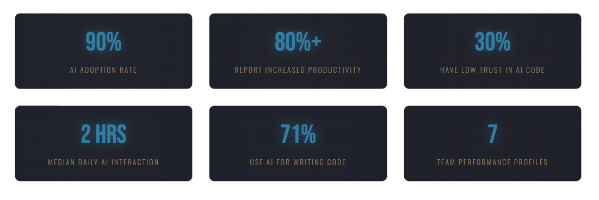

# AI and the Fundamentals of Software Engineering — What the 2025 DORA Report Really Tells Us

*"AI won't replace software engineers, but it will expose the ones who never learned to think like engineers."* 

This observation, echoing through developer forums and engineering discussions, captures the essence of what the 2025 DORA Report reveals: We've entered an era where artificial intelligence is not disrupting engineering discipline—it's rewarding it like never before.

## The Great Acceleration (And Its Hidden Dangers)

Picture this: 90% of developers now rely on AI programming assistance. 80% report measurable productivity improvements. Yet here's the paradox that should make every engineering leader pause: only 24% of respondents report a "great deal" or "a lot" of trust in AI, while 30% trust it "a little" or "not at all."

We're witnessing something unprecedented—a tool adoption so rapid and universal that it's outpacing our ability to trust it. As one developer put it on Stack Overflow: only 3% of developers report "high trust" in AI-generated output, suggesting widespread skepticism about the quality of AI-assisted code despite its prevalent use.

But here's what makes this fascinating rather than frightening: **This tension is exactly where innovation happens.**

## AI as Mirror and Multiplier

The report reveals a key insight: AI doesn't fix a team; it amplifies what's already there. Strong teams use AI to become even better and more efficient. Struggling teams will find that AI only highlights and intensifies their existing problems.

Think about that for a moment. Every organization using AI is essentially holding up a mirror to its own capabilities. What do you see in yours?

For high-performing organizations with solid foundations, AI becomes a powerful accelerator. For those with dysfunctional systems, it magnifies chaos. This isn't a bug—it's a feature. AI is forcing us to confront the technical debt, process inefficiencies, and cultural issues we've been sweeping under the rug for years.

## The Seven Capabilities That Matter Now

The DORA team didn't just identify the problem—they mapped the solution. Seven capabilities separate organizations that thrive with AI from those that struggle:

### 1. **Clear and Communicated AI Stance**
Not just a policy document gathering dust, but a living understanding of what AI is for—and crucially, what it's not for. The most successful organizations lay a foundation for their AI use: internal platforms, policies, clear workflows, and strong communication around AI.

### 2. **Working in Small Batches**
Kent Beck, the father of Test-Driven Development, discovered something remarkable while experimenting with AI coding assistants: he's having trouble stopping AI agents from deleting tests in order to make them "pass!" His solution? Even smaller batches, even tighter feedback loops. The fundamentals don't change—they intensify.

### 3. **Healthy Data Ecosystems**
Remember "garbage in, garbage out"? Now it's "garbage in, garbage out at machine scale, propagated across your entire codebase in milliseconds." AI adoption also increases software delivery instability unless your organization has built the right observability foundation.

### 4. **AI-Accessible Internal Data**
Your documentation, your APIs, your decision logs—if AI can't access them, you're running at half speed. This isn't about technology; it's about organizational knowledge management finally getting the attention it deserves.

### 5. **User-Centric Focus**
Here's the stunning finding: teams with a user-centric focus experience the strongest performance gains from AI adoption. Without this focus, AI adoption can even have a negative impact on performance. AI without direction is just expensive randomness.

### 6. **Quality Internal Platforms**
"A high-quality platform serves as the distribution and governance layer required to scale the benefits of AI from individual productivity gains to systemic organizational improvements. Without this foundation, AI adoption remains a series of disconnected local optimizations."

### 7. **Strong Version Control Practices**
With AI generating code at unprecedented speeds, your version control isn't just about tracking changes—it's your safety net, your audit trail, and your sanity check all rolled into one.

## The Hallucination Problem (And Why It's Teaching Us Something Profound)

Let's address the elephant in the room: AI hallucinates. In the context of Large Language Models, "hallucinations" refer to instances where the model generates information or data that was not explicitly present in its training data.

Developers are discovering AI confidently inventing functions that don't exist, importing libraries that were never created, and yes, even trying to disable tests to make them pass. Security researchers have found that if ChatGPT recommends a non-existent code library or package, a hacker could create a package with the same name, fill it with malicious code, and then distribute it to unsuspecting developers.

But here's the counterintuitive insight: The moment you run LLM generated code, any hallucinated methods will be instantly obvious: you'll get an error. Compare this to hallucinations in regular prose, where you need a critical eye, strong intuitions and well developed fact checking skills.

The hallucination problem isn't killing AI adoption—it's teaching us to be better engineers. It's forcing us to:
- Write comprehensive tests (because we can't trust the output)
- Review code more carefully (because confidence doesn't equal correctness)
- Build better validation systems (because "it compiled" isn't enough anymore)

## From Individual Speed to Organizational Excellence

AI tends to deliver "local optimizations" — an engineer codes faster, a test suite runs quicker — but without Value Stream Management, those wins don't always roll up into business outcomes.

This is perhaps the most important lesson: Individual productivity gains mean nothing if they don't translate to organizational value. You can generate code 10x faster, but if it increases your technical debt, breaks production more often, or doesn't solve real user problems, you're just failing faster.

Dave Farley, co-author of "Continuous Delivery," puts it brilliantly when reflecting on the report: Programming requires three things, and AI puts all of them at risk:
1. A precise specification of what we want
2. Verification that we got what we wanted
3. The ability to make progress in small steps

These aren't new lessons. They're the same timeless engineering values that have guided modern software craftsmanship since its inception. **AI doesn't erase them—it magnifies their importance.**

## The Human Element: Trust, Responsibility, and Craft

Dr Laura Weis observes that "faster doesn't always mean better. The 2025 DORA report shows it clearly: AI helps people push out more work. But the real headaches - burnout, broken processes, clunky cultures - don't go away. In some teams, the pressure just ramps up: more output expected, same resources, same stress."

This brings us to a crucial realization: AI is changing what it means to be a developer, but not in the way many feared. We're spending:
- Less time on boilerplate and syntax
- More time on design intent, architectural clarity, and system verification
- Less time typing
- More time thinking

Kent Beck, with over five decades of programming experience, says he's more excited than ever to code. Why? Because AI is handling the tedious parts, freeing him to focus on what matters: solving interesting problems.

## The Path Forward: Experimentation Over Dogma

The report makes one thing crystal clear: There's no going back. With 90% adoption among software professionals and developers spending a median of two hours daily working with AI tools, the transformation is irreversible.

But here's what's exciting: We're all beginners again. Even Kent Beck is figuring this out in real-time, sharing his experiments and failures openly. "People should be experimenting. Try all the things, because we just don't know. The whole landscape of what's 'cheap' and what's 'expensive' has all just shifted."

Start small. Experiment safely. Let AI help you where the stakes are low:
- Generate boilerplate code
- Write test cases
- Create documentation
- Refactor simple functions

Then gradually expand as you build confidence—not in the AI, but in your ability to guide it, verify its output, and integrate it into disciplined engineering practices.

## The Bottom Line: Engineering Matters More Than Ever

DORA has always been the sober voice in a hype-driven industry. Back in 2014, it told us faster could be safer. Now it's telling us something equally profound: AI doesn't change the game—it raises the stakes.

The fundamentals remain unchanged:
- **Specify precisely** (because natural language is vague, and AI amplifies ambiguity)
- **Verify relentlessly** (because an AI that's 80% correct is still 20% wrong)
- **Progress incrementally** (because big AI-generated changes are big risks)

Do these well, and AI becomes not a threat but a multiplier—a tool that extends the reach of disciplined engineers into new realms of possibility.

## Your Next Steps

The 2025 DORA Report doesn't call for revolution—it calls for evolution. Here's how to start:

1. **Assess honestly**: Where is your team on the seven capabilities? Pick one to improve this quarter.

2. **Start experimenting**: Give developers time and space to learn AI tools safely. Create sandboxes for experimentation.

3. **Measure what matters**: Not lines of code generated, but value delivered. Not speed of development, but stability of systems.

4. **Invest in fundamentals**: Your testing, your platforms, your version control—these aren't overhead, they're your foundation.

5. **Foster curiosity over fear**: Every senior developer today is a junior developer in the age of AI. Embrace being a beginner again.

## Conclusion: From Skepticism to Mastery — There's No Way Around AI

The 2025 DORA Report makes one thing unambiguously clear: AI-assisted software development is no longer a hype. It has reached the mainstream.

With 95% of developers already using AI assistance and the majority reporting measurable productivity gains, the question is no longer *if* but *how* we integrate AI responsibly into our engineering practices. From my perspective, there is no way around this transformation — only a choice in how well prepared we are to handle it.

Even if you remain skeptical, the best approach is not to wait, but to start — carefully and deliberately. Begin where the risk is lowest: let AI assist you with non-productive code — helper scripts, small utilities, unit tests, or test data generators. These are perfect sandboxes to explore how AI can augment your work. You'll quickly discover that its value lies not in replacing engineering expertise but in amplifying structured thinking and accelerating feedback cycles.

As with every major shift in software engineering, success depends on discipline: precise specification, verifiable outcomes, and incremental progress. These fundamentals have not changed — they've simply become more important in the age of AI. The sooner developers internalize AI as a new tool in the craft of engineering, the sooner we can move from uncertainty to mastery.

The DORA 2025 Report confirms what the best engineers have always known: There are no shortcuts to quality. There's no substitute for discipline. And there's no tool—no matter how intelligent—that can replace the human ability to think, design, and care about the systems we build.

**AI will not make good engineers obsolete. It will make good engineering indispensable.**

So start experimenting. Keep your tests green. Question everything the AI suggests. And remember: In an age of artificial intelligence, the most valuable skill is still very human—the ability to think critically about what we're building and why.

The future belongs to those who can harness the speed of machines while maintaining the judgment of craftspeople. Will you be among them?

---

## References

### Primary Sources

1. **2025 DORA State of AI-Assisted Software Development Report**  
   https://dora.dev/research/2025/dora-report/

2. **Dave Farley - YouTube Video on DORA Report and AI**  
   https://www.youtube.com/watch?v=CoGO6s7bS3A

### DORA Report Coverage and Analysis

3. **Google Cloud Blog - Announcing the 2025 DORA Report**  
   https://cloud.google.com/blog/products/ai-machine-learning/announcing-the-2025-dora-report

4. **Google Cloud Blog - How are developers using AI? Inside Google's 2025 DORA report**  
   https://blog.google/technology/developers/dora-report-2025/

5. **IT Revolution - AI's Mirror Effect: How the 2025 DORA Report Reveals Your Organization's True Capabilities**  
   https://itrevolution.com/articles/ais-mirror-effect-how-the-2025-dora-report-reveals-your-organizations-true-capabilities/

6. **InfoQ - DORA Report Finds AI Is an Amplifier in Software Development, But Trust Remains Low**  
   https://www.infoq.com/news/2025/09/dora-state-of-ai-in-dev-2025/

7. **DevOps.com - DORA 2025: Faster, But Are We Any Better?**  
   https://devops.com/dora-2025-faster-but-are-we-any-better/

8. **Opsera - DORA Report 2025: How AI Adoption Shapes DevOps and Software Teams**  
   https://opsera.ai/blog/dora-2025-report-ai-software-development/

9. **Honeycomb - What the 2025 DORA Report Teaches Us About Observability and Platform Quality**  
   https://www.honeycomb.io/blog/what-2025-dora-report-teaches-us-about-observability-platform-quality

### AI Hallucinations and Trust Issues

10. **Snyk - AI Hallucinations: How Do They Happen And Why Is It An Issue For Development?**  
    https://snyk.io/blog/ai-hallucinations/

11. **Trend Micro - The Mirage of AI Programming: Hallucinations and Code Integrity**  
    https://www.trendmicro.com/vinfo/us/security/news/vulnerabilities-and-exploits/the-mirage-of-ai-programming-hallucinations-and-code-integrity

12. **Medium/Checkmarx - Trusting AI-Generated Code: Determining Reality from Hallucination**  
    https://medium.com/checkmarx-security/trusting-ai-generated-code-determining-reality-from-hallucination-4deaa595eb41

13. **Simon Willison - Hallucinations in code are the least dangerous form of LLM mistakes**  
    https://simonwillison.net/2025/Mar/2/hallucinations-in-code/

14. **InfoWorld - How to keep AI hallucinations out of your code**  
    https://www.infoworld.com/article/3822251/how-to-keep-ai-hallucinations-out-of-your-code.html

15. **Diffblue - Precision over hallucination: Why AI in software development needs accuracy**  
    https://www.diffblue.com/resources/precision-over-hallucination-why-ai-in-software-development-needs-accuracy/

### Kent Beck and Engineering Perspectives

16. **The Pragmatic Engineer - TDD, AI agents and coding with Kent Beck**  
    https://newsletter.pragmaticengineer.com/p/tdd-ai-agents-and-coding-with-kent

17. **Kent Beck - Augmented Coding: Beyond the Vibes**  
    https://tidyfirst.substack.com/p/augmented-coding-beyond-the-vibes

18. **O11ycast Podcast - Augmented Coding with Kent Beck**  
    https://www.heavybit.com/library/podcasts/o11ycast/ep-80-augmented-coding-with-kent-beck

19. **Martin Fowler's Bliki - Test Driven Development**  
    https://martinfowler.com/bliki/TestDrivenDevelopment.html

### Dave Farley and Modern Software Engineering

20. **Tech Lead Journal - Modern Software Engineering with Dave Farley**  
    https://techleadjournal.dev/episodes/100/

21. **Medium/Typo - Webinar: The Hows and Whats of DORA with Dave Farley and Denis Čahuk**  
    https://medium.com/beyond-the-code-by-typo/webinar-the-hows-and-whats-of-dora-with-dave-farley-and-denis-%C4%8Dahuk-6b0e617eb571

22. **Dave Farley's Book - Modern Software Engineering: Doing What Works to Build Better Software Faster**  
    Available on Amazon and other retailers

### Additional Developer Survey Data

23. **Stack Overflow Developer Survey 2024** (Referenced for AI trust statistics)  
    Survey data showing only 3% of developers have "high trust" in AI-generated output

24. **GitHub Research** (Referenced for 97% developer AI usage statistic)  
    Study on developer adoption of AI coding tools

---

*Ready to dive deeper? Download the full [2025 DORA Report](https://dora.dev/research/2025/dora-report/) and join the conversation about how AI is reshaping—not replacing—software engineering excellence.*