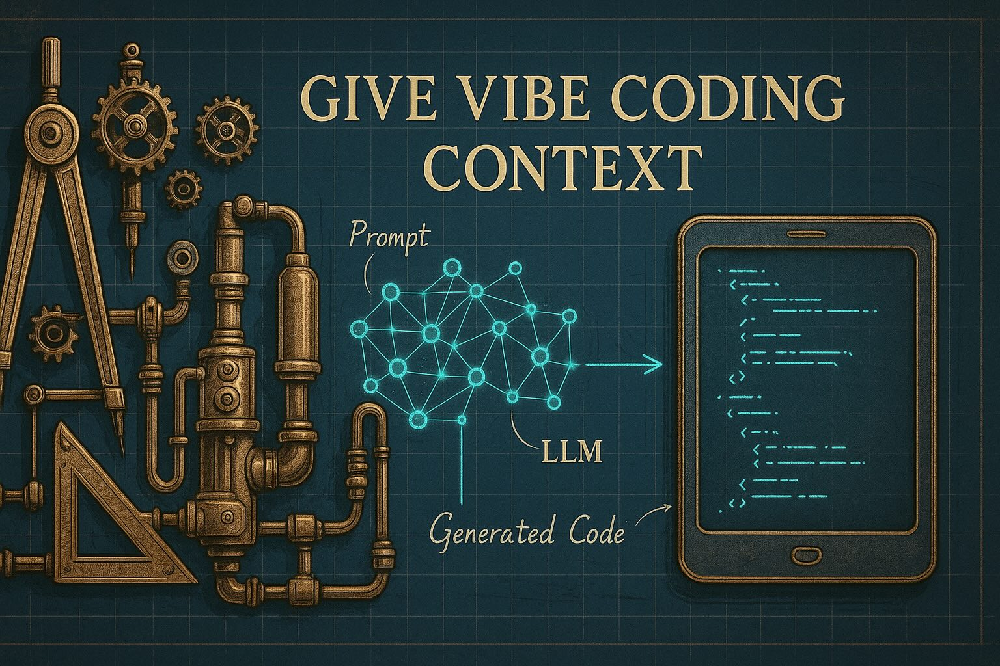

# Give Vibe Coding Context
How LLMs Understand Your Code Through Comments, Readmes, and Agentic IDEs



>
> In this blogpost, we’ll dive into one of the most transformative trends in modern software development: **vibe coding** — an AI-driven approach where human intent is translated into working code by large language models (LLMs).
>
> You’ll learn:
> - What vibe coding actually is, where it comes from, and why it matters.
> - How LLMs use **context** — and how that context shapes the quality and safety of generated code.
> - Why **inline documentation** and **README.md files** are not just helpful for humans, but critical for LLMs to “understand” your codebase.
> - How modern **agentic IDEs** automate documentation, enabling a flow where your only job is to guide and review — not to type boilerplate.
> - And finally, how to structure your projects so that each submodule becomes self-explanatory to both humans and AI assistants.
>
> Whether you're a curious engineer, a technical lead exploring next-gen workflows, or a product-minded builder trying to ship faster — this post will give you practical insights, concrete examples, and reusable prompts to supercharge your coding process.
>
> Let’s give vibe coding the context it deserves.

# What is Vibe Coding?
**Vibe coding** is an AI-driven software development paradigm where developers describe the desired functionality in natural language, allowing large language models (LLMs) to generate code accordingly. Coined by OpenAI co-founder [Andrej Karpathy](https://en.wikipedia.org/wiki/Vibe_coding#Origin) in February 2025, vibe coding transforms the programmer’s role into that of a guide, tester, and refiner of AI-generated code.

Proponents claim vibe coding democratizes software creation, enabling non-programmers to build functional applications. A notable example is journalist [Kevin Roose](https://en.wikipedia.org/wiki/Vibe_coding#Examples), who used it to develop a lunchbox-suggestion app based on ingredients.

However, critics like [Simon Willison](https://en.wikipedia.org/wiki/Vibe_coding#Criticism) warn of the risks, such as buggy or insecure code due to misunderstandings of AI outputs. These concerns underscore the importance of human oversight.

Despite this, adoption is growing. In fact, [25% of startups](https://en.wikipedia.org/wiki/Vibe_coding#Adoption) in Y Combinator’s Winter 2025 batch reportedly rely mainly on AI-generated code.

🔗 **Full article**: [https://en.wikipedia.org/wiki/Vibe_coding](https://en.wikipedia.org/wiki/Vibe_coding)


# What is the LLM Context?
In the world of large language models (LLMs), *context* refers to the information the model can "see" and use while generating responses. This includes everything from your current prompt to prior parts of a conversation or text. The context acts as the short-term memory of the model, and it directly influences the relevance, accuracy, and coherence of its output.

LLMs operate on a **fixed-size context window**, measured in tokens (chunks of words or characters). For example, some models can handle up to one million tokens (as of spring 2025 there is already an experimental model with up to 10 million token context size), allowing them to process entire documents or long conversations at once. Within this window, the model performs [in-context learning](https://en.wikipedia.org/wiki/Prompt_engineering) — a capability that lets it mimic understanding and solve problems based on examples or instructions given directly in the prompt, without retraining.

The [structure of LLMs](https://en.wikipedia.org/wiki/Large_language_model) is built to process this context efficiently, using architectures like transformers that attend to every token relative to others. This means the position and phrasing of information matter — earlier context can be “forgotten” if the window is exceeded.

Different models vary in their capacity and design. A [comparison of LLMs](https://en.wikipedia.org/wiki/List_of_large_language_models) shows how context length differs across providers, influencing what tasks they’re best suited for.

**In summary, LLM context is the dynamic workspace where understanding happens. It's the combination of your words, the model’s memory, and any structured inputs that guide how it thinks and responds.**

# Context in Vibe Coding – From Blank Slate to Project-Aware Intelligence

When you start a plain chat with an LLM — say, via ChatGPT or Claude — the model begins with an **empty context**. Aside from its pre-trained global knowledge and the static *system prompt* (which might define behavior, tone, or persona), the LLM knows nothing about your specific intent. Everything relevant to the task — your goals, background, data, or code—must be provided manually through the chat. The model’s **working memory**, its context window, is then filled with your prompt and the ongoing conversation history.

This dynamic is quite different in modern **vibe coding** tools like [GitHub Copilot](https://en.wikipedia.org/wiki/Copilot), Windsurf, or Cursor. These tools don’t rely on you to provide every detail. Instead, they **actively retrieve missing context** from your codebase. When you ask, “Refactor this function,” the tool doesn't just guess — it looks into your source code, navigates your file structure, extracts relevant class definitions, interfaces, constants, and comments, and injects them into the prompt it sends to the model.

This workflow leverages a method called [Retrieval-Augmented Generation (RAG)](https://en.wikipedia.org/wiki/Retrieval-augmented_generation). RAG enhances LLMs by supplying them with retrieved, domain-specific documents — in this case, your own source code. Think of it as dynamically teaching the model about your project every time you prompt it, with zero retraining and minimal latency.

This context injection is what transforms vibe coding tools into true assistants. Not just autocomplete on steroids, but tools that "understand" your codebase enough to safely generate, refactor, document, or debug it.
If the retrieval step works efficiently and selects the right context fragments, then the LLM doesn’t just respond based on abstract general knowledge — it **operates with immediate awareness of your project**. The model's context, originally empty, becomes a real-time, curated representation of the task-relevant code. In this way, **vibe coding becomes a process of teaching the LLM what it needs to know** — on the fly — without you even noticing it.

## Inline Documentation – The Hidden Power-Up for Vibe Coding

In classic software development, inline documentation helps humans understand code. In the era of vibe coding, it’s even more valuable: comments and docstrings become knowledge fragments that LLMs can use to generate better code.

### Why LLMs Love Good Comments

Large language models thrive on clear, structured documentation. Comments that explain what code does, why it exists, and how to use it give the model crucial context. Including usage examples in function comments is especially helpful — they show the model not just what a function does, but how it’s used in practice.

**Example:**
```typescript
/**
   * Correlates two time series by matching their timestamps within a specified maximum time difference.
   *
   * For each event in the current time series, the method finds the closest event in the other time series
   * within the `maxDeltaTimeSeconds` threshold. If no such event exists, the event is skipped.
   *
   * @param other - The other time series to correlate with.
   * @param maxDeltaTimeSeconds - The maximum allowed time difference (in seconds) for correlation.
   * @returns A new `TimeSeries<[number, number]>` where each event contains a pair of correlated values.
   *
   * @throws {Error} If either time series is empty.
   *
   * @example
   * ```ts
   * const ts1 = new TimeSeries<number>([
   *   { t: new Date('2023-01-01T00:00:00Z'), v: 1 },
   *   { t: new Date('2023-01-01T01:00:00Z'), v: 2 },
   * ]);
   * const ts2 = new TimeSeries<number>([
   *   { t: new Date('2023-01-01T00:00:30Z'), v: 10 },
   *   { t: new Date('2023-01-01T01:00:30Z'), v: 20 },
   * ]);
   * const correlated = ts1.correlateInTime(ts2, 60);
   * console.log(correlated.getEvents());
   * // Output: [
   * //   { t: new Date('2023-01-01T00:00:00Z'), v: [1, 10] },
   * //   { t: new Date('2023-01-01T01:00:00Z'), v: [2, 20] },
   * // ]
   * ```
   */
  correlateInTime<U>(other: TimeSeries<U>, maxDeltaTimeSeconds: number): TimeSeries<[T, U]> {
    if (this.events.length === 0 || other.getEvents().length === 0) throw new Error("Both time series must be non-empty.");

    const correlatedSeries = new TimeSeries<[T, U]>();
    const maxDeltaTimeMs = maxDeltaTimeSeconds * 1000;
    ....
  }
```
This comment doesn’t just describe the function—it demonstrates usage and expected output. That’s exactly the kind of context LLMs need to generate accurate suggestions or safely refactor code.

### Benefits for Teams and Tools

Well-documented code also helps humans: modern IDEs (like VS Code or WebStorm) show comments in tooltips and autocompletion, making code easier to use and reducing misunderstandings. This is especially valuable for onboarding new team members or collaborating on larger projects.

## How Agentic IDEs Make Documentation Effortless

Traditionally, writing and updating inline documentation was tedious and often neglected under tight deadlines. In vibe coding environments — especially those using agentic IDEs — this burden is lifted.

### The Role of Agentic IDEs

Modern IDEs like Cursor, Windsurf, or setups powered by LLMs (such as GPT-4 or Claude 3.5) introduce agentic workflows: background AI processes that proactively assist you. For documentation, these agents do more than autocomplete — they monitor code changes, compare them to existing comments, and automatically update docstrings or JSDoc blocks as needed.

**Example system prompt for auto-syncing documentation:**

After you make changes to a source file, the agent can run a prompt like this:

```Markdown
You are a senior software engineer and documentation expert. Your task is to **analyze existing, already-documented source code**, detect where the **code has changed**, and ensure that **all documentation is fully up to date**.

### Instructions:
- **Do not modify any code** under any circumstances.
- Carefully **compare the existing documentation** (comments, docstrings, annotations) with the current implementation.
- If the documentation **no longer matches the code**, rewrite it to **accurately reflect the current logic, data structures, method signatures, parameters, return values, side effects, and behavior**.
- Retain the original documentation style (e.g., JSDoc, Python docstring, JavaDoc, etc.).
- Ensure terminology, variable names, and formatting are consistent with the rest of the code.
- If a section of code has been added but lacks documentation, **add concise and clear documentation** for it.
- If existing documentation is still correct, **leave it untouched**.
- Only return the updated version of the source code with revised documentation. Do not explain your changes unless asked to.

### Input:
A single source file that contains both implementation and outdated or non existing documentation.

Your output must preserve:
1. The complete source code,
2. All updated or newly added documentation,
3. The original file structure and indentation.

Start by reviewing this file and updating documentation accordingly.
```

This process makes documentation a seamless, automated post-processing step—similar to running Prettier or ESLint. The agent leverages the LLM’s context, including your recent prompts and edits, to keep docs in sync.

### Your Role: Reviewer, Not Author

With agentic IDEs, your responsibility shifts from writing documentation to reviewing and approving it. While human oversight is still important (to catch hallucinations or domain-specific errors), the heavy lifting is handled by the agent.

### Living Documentation

Combining Retrieval-Augmented Generation with agentic workflows ensures:
- Inline comments stay current.
- Example blocks reflect the latest APIs.
- Onboarding is smoother for new developers.
- IDE tooltips remain accurate and useful.

In vibe coding, documentation evolves with your codebase—always up-to-date, always helpful, and maintained automatically in the background.

Certainly! Here’s a fully developed and technically precise section for your blog post about the role of README.md files in vibe coding workflows:


# README.md – The Contextual Glue of Vibe-Coded Projects

In vibe coding, where large language models generate code by leveraging both natural language prompts and dynamic context retrieval, the humble `README.md` file becomes a strategic asset. It’s no longer just a developer-facing entry point—it serves as a context provider, a source of ground truth, and a bridge between human intent and machine reasoning.

## More Than Just a Welcome Note

Traditionally, a `README.md` in the root directory describes the project’s purpose, installation steps, and usage instructions. In vibe-coded projects, this pattern extends to every subdirectory. Why? Because context is local.

When working inside a module—such as `/auth/`, `/sensor/`, or `/heating-scheduler/`—the LLM lacks awareness of the module’s intent unless explicitly informed. While an agentic IDE might retrieve function signatures or class names, without deeper semantic context, its suggestions can be generic or inaccurate.

This is where a local `README.md` becomes essential.

## README as a Context Anchor

In effective vibe-coding workflows, every subfolder contains its own `README.md`. These files are not decorative — they are injected directly into the LLM’s context window when you work within that directory. This enables the model to understand:

- The module’s purpose
- Key data structures
- Design decisions and constraints
- Integration points with other modules
- Known issues or workarounds
- Usage examples or patterns

This transforms the LLM from a generic code generator into a project-aware assistant.

## Agentic Retrieval Makes It Automatic

Agentic IDEs actively seek out relevant context. When you prompt, “Add logging to this method” or “Rewrite this API handler to use V3 schema,” the IDE will:

1. Detect your current working directory.
2. Locate the nearest `README.md`.
3. Parse its contents and inject them into the LLM prompt.

This process is seamless for the developer but crucial for providing the model with local architectural and domain knowledge before code generation.

## Modular Wisdom at Scale

Embedding `README.md` files per directory also enhances clarity in large monorepos or microservice architectures. This distributed documentation pattern ensures:

- Each module has a clear, self-contained scope.
- LLM prompts receive targeted, relevant context.
- Onboarding is simplified — developers can start in any subdirectory and quickly grasp its role.

In vibe coding, well-maintained `README.md` files are not just documentation — they are the contextual glue that enables intelligent, context-aware code generation at every level of your project.

## Keeping README.md Up to Date – One Prompt at a Time

Documentation can quickly become outdated — unless its maintenance is built into your workflow. In vibe coding projects, this is solved by leveraging LLMs to regenerate or update each module’s `README.md` whenever the code changes.

Instead of manually rewriting documentation, you prompt the LLM to extract structure, intent, and usage directly from the source code and recent edits. Agentic IDEs, which retain context from your latest changes, make this process especially effective: the model can accurately summarize the module’s purpose, architecture, and usage in markdown.

### My README.md Generation Prompt

Here’s the prompt I use to keep module documentation current. I provide the existing `README.md` (if available) and the relevant source files. The LLM then rewrites or updates the documentation to match the latest implementation, ensuring clarity and human readability.

> **Pro Tip:** Run this prompt right after finishing a round of changes to a submodule. The LLM’s context will still include your recent coding decisions and rationale, resulting in more accurate documentation.

```markdown
Your task ist to generate a README.md file for a directory
# Step 1: If not provided, ask me for the directory
# Step 2: If in the direcory already a README.md exists, read it in to update it.
# Step 3: Analyze the directory and its contents
To analyze, read a list of all files und subdirectories of the directory
# Step 4: Iterate over All subdirectiries:
  **Case A**: If a Subfolder has it's own README.md file, then the README.md in the subfolder describes the content of the subfolder. Read in the README of that subfolder and reflect it as a brief summary for this readme link to the README.md of the subfolder.
  **Case B**: A Subfolder has no README.md, then read in the filestructure of that subdirectory and infer the purpose of that subfolder based on the file names, structure, and content. Describe the purpose and functionality of the subfolder in the README.md.
# Step 5 - Iterate over All files:
  For each file in the directory read in the file, infer the purpose and functionality based on the file names, structure, and content.
  Describe the purpose and functionality of each source file in the README.md.
# Constraints:
  1. Focus on clarity, structure, and usefulness for new developers.
  2. Do not invent functionality or features that cannot be inferred from the files.
  3. Follow standard Markdown conventions for headers, lists, and formatting.
# Links:
  1. Create relative links to references source and files of the subfolders.
  2. Check the relativity of the file to the refined README.md, for example the link for dir/subfolder/file.ext
      should be [subfolder/file.ext](./subfolder/file.ext)
# Additional content:
If i provide additional content, fetch or read the content and decide the usefulness to include it in the README.md.
  1. If the content is helpful for understanding the context of the sourcecode, include it in the README.md.
  2. If the content is not helpful for understanding the context of the sourcecode, do not include it in the README.md.
# Output:
  1. Write a high-quality README.md file in Markdown format based on the findings.
  2. If the structure warrants it, use Mermaid diagrams (in Markdown) to visualize the architecture, workflows, or relationships between components.
  3. If something is unknown to you do not assume or invent information, instead, leave the information out avoid placeholders.
```

### Living Documentation in Practice

By integrating this prompt into your development routine, every module’s README becomes a living, accurate reflection of the codebase—always up to date for both humans and LLM-powered tools. This approach shifts documentation from a manual chore to an automated, high-leverage step, letting you focus on design and intent while the agents handle the details.

> # Wrapping Up – Context Is the New Compiler
> 
> Vibe coding is more than just letting AI write code—it’s about designing an ecosystem where **intent, structure, and documentation align** to empower intelligent agents to generate reliable, maintainable, and project-aware software.
> 
> Here’s what we’ve explored:
> - **Vibe coding** redefines the role of the developer—from implementer to orchestrator.
> - **Context** is the core enabler: the more the LLM knows, the better it performs.
> - **Inline documentation** acts as immediate, machine-readable context—and can now be auto-maintained with agentic workflows.
> - **README.md files**, placed at every level of your project structure, serve as contextual glue—anchoring meaning and purpose for both humans and machines.
> - With well-designed prompts, **LLMs don’t just generate code—they evolve your documentation**, making onboarding, collaboration, and maintainability smoother than ever.
> 
> By thoughtfully combining natural language, structured documentation, and smart tooling, vibe coding becomes a productivity multiplier—not a black-box risk. The future of software is conversational, contextual, and collaborative—and it starts with how we teach our tools to understand our intent.
> 
> **Give your code the context it deserves. The results will speak for themselves.**
