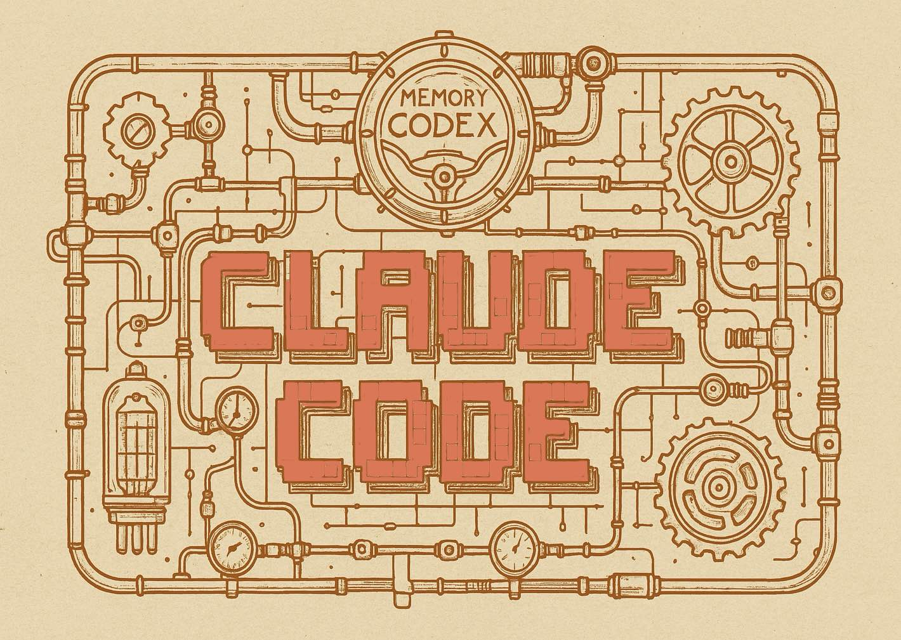

# Claude Code's Memory: Working with AI in Large Codebases
Transform Token Costs into Team Knowledge with Smart Memory Management





## 1. Claude Code: It's Not a Tool — It's a Mindset Shift

Over the years, I've seen dozens of developer tools that promised to revolutionize the way we write code. Most of them end up helping around the edges — they autocomplete a function, suggest some refactoring, maybe speed up boilerplate generation. Useful, yes. But transformative? Rarely.

Claude Code is something else entirely.

It doesn't just sit beside you like a helpful assistant. It *thinks* with you. Plans with you. Refactors with you. Claude Code is more like a pair-programming partner with senior-level insight — embedded right in your terminal, where the context lives and the distractions fade away. You give it a goal, and it doesn't just react. It builds a plan, breaks it into tasks, writes its own code and tests, and returns with results that often need no further tweaking.

That's what I find most refreshing: Claude Code behaves like an engineer who respects the craft. It doesn't try to impress with noisy outputs or shallow shortcuts. Instead, it embraces the complexity of the work — and gets it done.

In my humble (and terminal-prompted) opinion: Claude Code is the first AI that *codes like it gets it*. It's not just a tool in your workflow. It *is* the workflow — when you let it be.


## 2. Why Token Efficiency Matters — and What It Costs to "Let Claude Cook"

When working with Claude Code on a large codebase, the flow of development changes fundamentally. You don't just jump between coding and prompting. Instead, Claude takes the wheel for long stretches. You hand it a task, and it quietly spins up: crawling through your codebase, absorbing patterns, understanding architecture, formulating a strategy — before it even starts writing a line of output.

This depth is what makes Claude Code powerful — but it's also what makes it **expensive** in a very concrete way.

Whether you're on a pay-as-you-go API model or a fixed monthly plan like Claude MAX, every request Claude processes consumes tokens — and those tokens come with limits. You're not just charged for how often you use it, but also for how much it reads and how deeply it thinks.

Each interaction with Claude involves three interlinked cost drivers:

$$
\text{Impact} = (\text{LLM Calls}) \times (\text{Tokens per Call}) \times (\text{Model Quality})
$$

First, there's the number of calls you make. Every time Claude starts "thinking," it counts. Then there's how much it *needs* to think — which is directly tied to how many tokens your request consumes. Claude often needs to load thousands of lines of context to answer even seemingly simple questions, especially on larger codebases. Finally, there's the model you choose. Claude Opus, for instance, provides deeper, more nuanced answers than Sonnet — but it also costs significantly more per token.

It's easy to fall into the trap of asking Claude to "figure it out" again and again — letting it repeatedly parse the same files, rediscover the same structures, and re-analyze your architecture from scratch. The result? You burn through your token budget without realizing it, and the efficiency gains you were hoping for evaporate.

That's why understanding and managing Claude's memory system is essential. It's the difference between working with an architect who remembers your blueprints — and one who has to re-read them every time you ask a question.

Let's explore how that works.

## 3. The Claude Code Memory System: Your Persistent Context Architect

[TL;DR Infographic](https://claude.ai/public/artifacts/9aa92244-1f92-40e8-a168-b815643f5ca8)

Claude Code's memory system is deceptively simple on the surface — it's just Markdown files. But beneath this simplicity lies a sophisticated hierarchical system that fundamentally changes how AI understands your codebase.

### The Three-Tier Architecture

Think of Claude's memory as a nested set of contexts, each serving a distinct purpose:

**Project Memory (`./CLAUDE.md`)** — This is your team's shared brain. It lives in your repository root and gets committed to version control. Here's where you document your architectural decisions, coding conventions, API patterns, and anything else that should be consistent across your team. When a new developer joins, they're not just inheriting code — they're inheriting the collective wisdom of how that code should evolve.

**Local Project Memory (`./CLAUDE.local.md`)** — Your personal workspace notes. Maybe you're testing against a specific sandbox URL, or you have particular debugging strategies for this project. This file is gitignored, keeping your individual preferences and temporary context separate from the team's shared knowledge. It's like having sticky notes on your monitor — except Claude can read them too.

**User Memory (`~/.claude/CLAUDE.md`)** — Your global preferences that travel with you across all projects. Prefer tabs over spaces? Always use specific ESLint rules? Have a particular way of structuring your commits? This is where those preferences live, automatically merged into every Claude session under your home directory.

### How Claude Loads Context

The magic happens in how Claude discovers and loads these files. It's not a simple "load everything" approach — that would blow through your token budget instantly. Instead, Claude employs a recursive search strategy that's both comprehensive and efficient.

Starting from your current working directory, Claude searches upward toward the root, loading every `CLAUDE.md` and `CLAUDE.local.md` file it finds. This means you can have general guidelines at your repository root and increasingly specific instructions as you dive into subdirectories. A React component deep in your source tree can have its own memory file with component-specific patterns, while still inheriting the broader architectural context from above.

But here's the clever part: subdirectory memory files are only loaded when Claude actually accesses files in those directories. This on-demand loading keeps your active context focused and prevents token waste on irrelevant parts of your codebase.
```
╔══════════════════════════════════════════════════════════════════════╗
║                     Claude's Memory Loading Strategy                 ║
╚══════════════════════════════════════════════════════════════════════╝

  ~/.claude/
  └── 📄 CLAUDE.md ← ─ ─ ─ ─ ─ ─ ─ ─ ─ ─ ─ ┐
       [global preferences]                │ ALWAYS LOADED
                                           │ (under home dir)
  ~/projects/awesome-app/                  │
  ├── 📄 CLAUDE.md ← ─ ─ ─ ─ ─ ─ ─ ─ ─ ─ ─ ┤
  │    [project architecture, team rules]  │
  ├── 📄 CLAUDE.local.md ← ─ ─ ─ ─ ─ ─ ─ ─ ┤ LOADED when working
  │    [your sandbox URLs, local notes]    │ anywhere in project
  │                                        │
  ├── 📁 apps/                             │
  │   ├── 📁 web/                          │
  │   │   ├── 📄 CLAUDE.md ← ─ ─ ─ ─ ─ ─ ─ ┼ ─ ─ ┐
  │   │   │    [React patterns, UI rules]  │     │ ONLY when working
  │   │   └── 📁 components/               │     │ in apps/web/**
  │   │       └── 🔷 Button.tsx ← ─ ─ ─ ─ ─│─ ─ ─•
  │   │                                    │
  │   └── 📁 api/                          │
  │       ├── 📄 CLAUDE.md                 │ ← NOT loaded when
  │       │    [API patterns, REST rules]  │   working on Button.tsx
  │       └── 📁 services/                 │
  │                                        │
  ├── 📁 infrastructure/                   │
  │   ├── 📄 CLAUDE.md                     │ ← NOT loaded when
  │   │    [Terraform patterns, AWS]       │   working on Button.tsx
  │   └── 📁 modules/                      │
  │                                        │
  └── 📁 docs/                             │
      └── 📄 architecture.md ← ─ ─ ─ ─ ─ ─ ┘
           [@imported only when needed]

  ┌────────────────────────────────────────────────────────┐
  │ When working on Button.tsx, Claude loads:              │
  │                                                        │
  │ ✓ ~/.claude/CLAUDE.md          (global memory)         │
  │ ✓ ~/projects/awesome-app/CLAUDE.md                     │
  │ ✓ ~/projects/awesome-app/CLAUDE.local.md               │
  │ ✓ ~/projects/awesome-app/apps/web/CLAUDE.md            │
  │ ✗ ~/projects/awesome-app/apps/api/CLAUDE.md            │
  │ ✗ ~/projects/awesome-app/infrastructure/CLAUDE.md      │
  └────────────────────────────────────────────────────────┘
```

### The Import System: Modular Memory Management

As projects grow, memory files can become unwieldy. The community discovered that Claude supports an import system using `@path/to/file` syntax. This allows you to keep your main memory files lean while maintaining detailed specifications that can be loaded on demand.

For example, your root `CLAUDE.md` might look like this:

```markdown
# Project Overview
Next.js application with microservices backend

# Architecture
@docs/architecture/overview.md
@docs/architecture/api-design.md

# Coding Standards
- TypeScript strict mode
- Functional components with hooks
- @standards/testing-guidelines.md
```

This modular approach means Claude only loads the detailed testing guidelines when it needs to write or review tests, keeping your base context efficient.

### Memory in Practice: Real Patterns That Work

Through extensive community experimentation, several patterns have emerged as particularly effective:

**The Bootstrap Pattern**: Start new projects with `/init`, which analyzes your codebase and generates a comprehensive initial `CLAUDE.md`. It's like having Claude interview your codebase and take notes for future sessions.

**The Quick Memory Pattern**: Prefix any instruction with `#` to add it to memory instantly. Discovered a quirk in your build system? Just type `# build fails if NODE_ENV isn't set explicitly` and Claude files it away in the appropriate memory file.

**The Checkpoint Pattern**: Before major refactoring, explicitly tell Claude to update memory files with current architectural decisions. This creates a knowledge checkpoint that persists even if you need to start a fresh session.

### The Cost of Forgetting

Without proper memory management, every Claude session starts from scratch. On a large codebase, this means:
- Repeatedly explaining your architecture (500-1000 tokens each time)
- Re-establishing coding conventions (200-500 tokens)
- Clarifying project-specific patterns (300-800 tokens)
- Correcting misunderstandings about your tech stack (100-300 tokens per correction)

Multiply this by dozens of sessions, and you're looking at thousands of dollars in unnecessary token consumption — not to mention the time lost to repetitive explanations.

### Memory Maintenance: Keeping Your Context Fresh

Like any knowledge system, Claude's memory requires maintenance. Outdated or incorrect information in memory files can lead Claude astray, causing more harm than having no memory at all. The community has developed several maintenance strategies:

**Regular Reviews**: Periodically audit your memory files against your actual codebase. Architecture evolves, patterns change, and yesterday's best practices might be today's anti-patterns.

**Scoped Updates**: When you correct Claude about a specific implementation detail, immediately update the relevant memory file. This prevents the same misunderstanding in future sessions.

**Memory Budgets**: Keep core memory files under 500 lines. Use imports for detailed specifications, and be ruthless about removing obsolete information.

The most successful teams treat Claude's memory files as living documentation — not just for the AI, but for the entire development team. They've become a new form of architectural decision records, constantly evolving with the codebase they describe.

## 4. How to Keep Claude Code's Memory Efficient and Up to Date

After a while working with Claude Code, I've developed a set of prompts that transform memory management from a chore into a seamless part of the development workflow. These aren't just commands — they're conversations that teach Claude to be a better partner for your specific project.

### Teaching Claude to Remember: The Session Learning Prompt

The biggest waste in AI-assisted development isn't token consumption — it's knowledge loss. Every time you correct Claude or explain a project quirk, that learning typically vanishes when the session ends. Here's the prompt I use to capture these insights permanently:

```markdown
# Update CLAUDE Files with Relevant Knowledge from This Session

FYI: You, Claude Code, manage persistent memory using two main file types: `CLAUDE.md` for shared or global project context, 
and `CLAUDE.local.md` for private, developer-specific notes. The system recursively searches upward from the current 
working directory to load all relevant `CLAUDE.md` and `CLAUDE.local.md` files, ensuring both project-level and personal 
context are available. Subdirectory `CLAUDE.md` files are only loaded when working within those subfolders, 
keeping the active context focused and efficient. 
Additionally, placing a `CLAUDE.md` in your home directory (e.g., `~/.claude/CLAUDE.md`) provides a global, 
cross-project memory that is merged into every session under your home directory.

**Summary of Memory File Behavior:**
- **Shared Project Memory (`CLAUDE.md`):**
  - Located in the repository root or any working directory
  - Checked into version control for team-wide context sharing
  - Loaded recursively from the current directory up to the root
- **Local, Non-Shared Memory (`CLAUDE.local.md`):**
  - Placed alongside or above working files, excluded from version control
  - Stores private, developer-specific notes and settings
  - Loaded recursively like `CLAUDE.md`
- **On-Demand Subdirectory Loading:**
  - `CLAUDE.md` files in child folders are loaded only when editing files in those subfolders
  - Prevents unnecessary context bloat
- **Global User Memory (`~/.claude/CLAUDE.md`):**
  - Acts as a personal, cross-project memory
  - Automatically merged into sessions under your home directory

---

**Instructions:**  
If during your session:

* You learned something new about the project
* I corrected you on a specific implementation detail 
* I corrected source code you generated
* You struggled to find specific information and had to infer details about the project
* You lost track of the project structure and had to look up information in the source code

...that is relevant, was not known initially, and should be persisted, add it to the appropriate `CLAUDE.md` (for shared context) or 
`CLAUDE.local.md` (for private notes) file. If the information is relevant for a subdirectory only, 
place or update it in the `CLAUDE.md` file within that subdirectory.

When specific information belongs to a particular subcomponent, ensure you place it in the CLAUDE file for that component.
For example: 
* Information A belongs exclusively to the `heatsense-ui` component → put it in `apps/heatsense-ui/CLAUDE.md`
* Information B belongs exclusively to the `heatsense-api` component → put it in `apps/heatsense-api/CLAUDE.md`  
* Information C is infrastructure-as-code related → put it in `cdk/CLAUDE.md`

This ensures important knowledge is retained and available in future sessions.
```

I run this prompt at the end of productive sessions, especially after deep debugging or architectural discussions. It's like having Claude write its own notes for the next meeting — except the next meeting might be with a different developer on your team.

### The Directory Deep Dive: Building Context from Code

When starting work in a new area of the codebase, or when Claude seems to be missing crucial context, I use this investigation prompt. It's particularly powerful because it forces Claude to actually read and understand the code before making assumptions:

```markdown
# Investigate and Document Directory Architecture

**Instructions:**  
Focus on the specified directory $ARGUMENTS or the current working directory:

1. **Investigate Architecture**: Analyze the implementation principles and architecture of the code in this directory and its subdirectories. Look for:
   - Design patterns being used
   - Dependencies and their purposes
   - Key abstractions and interfaces
   - Naming conventions and code organization
   
2. **Create or Update Documentation**: Create a CLAUDE.md file capturing this knowledge. If one already exists, update it with newly discovered information. Include:
   - Purpose and responsibility of this module
   - Key architectural decisions
   - Important implementation details
   - Common patterns used throughout the code
   - Any gotchas or non-obvious behaviors
```

Pro tip: You can enhance this prompt by adding the session learning context from the first prompt. This creates a more comprehensive documentation update that captures both the code analysis and any corrections or clarifications from your current session.

### The Spring Cleaning: Keeping Memory Accurate

Memory files, like any documentation, can drift from reality. Code evolves, patterns change, and yesterday's truths become today's misconceptions. Here's my maintenance prompt that I run monthly (or after major refactoring):

```markdown
# Review and Update CLAUDE Memory Files

**Instructions:**  

**Step 1: Get Overview** 
List all CLAUDE.md and CLAUDE.local.md files in the project hierarchy.

**Step 2: Iterative Review** 
Process each file systematically, starting with the root `CLAUDE.md` file:
- Load the current content
- Compare documented patterns against actual implementation
- Identify outdated, incorrect, or missing information

**Step 3: Update and Refactor**
For each memory file:
- Verify all technical claims against the current codebase
- Remove obsolete information
- Consolidate duplicate entries
- Ensure information is in the most appropriate file

When information belongs to a specific subcomponent, ensure it's placed correctly:
* UI-specific patterns → `apps/myproject-ui/CLAUDE.md`
* API conventions → `apps/myproject-api/CLAUDE.md`
* Infrastructure details → `cdk/CLAUDE.md` or `infrastructure/CLAUDE.md`

Focus on clarity, accuracy, and relevance. Remove any information that no longer serves the project.
```

This isn't just housekeeping — it's an investment in future productivity. Clean, accurate memory files mean Claude starts every session with the right context, reducing both token usage and frustration.

### Making These Prompts Your Own

These prompts work well for my workflow, but the real power comes from adapting them to your needs. Some teams add sections for testing strategies, others include deployment notes, and I've seen developers create specialized prompts for API documentation or database schema updates.

The key insight? Treat these prompts as templates, not gospel. Start with what I've shared, but evolve them based on your project's unique needs. The best memory management system is the one your team actually uses.

One final thought: I've noticed that teams who commit to memory maintenance see compound benefits. Not only does Claude become more helpful over time, but the memory files themselves become valuable onboarding documents for human developers. It's documentation that writes itself — and stays current because it's actively used.

That's the beauty of Claude Code's memory system. It's not just about making AI smarter. It's about capturing and preserving the collective intelligence of your entire development process.

# Conclusion: We're All Still Learning
I've been coding for more years than I care to admit, and Claude Code is the first tool that made me fundamentally rethink how I approach development. Not because it writes perfect code — it doesn't. Not because it never makes mistakes — it does. But because it showed me that the real bottleneck in AI-assisted development isn't the AI's capabilities. It's our ability to share context effectively.

The memory techniques I've shared here aren't perfect. They're simply what's worked for me and my teams after experimentation, occasional frustration, and more than a few expensive token bills. I'm sure there are better patterns waiting to be discovered. That's the exciting part — we're all pioneers in this space, figuring out together how to build software in fundamentally new ways.

If you've found your own patterns for managing Claude's memory, I'd love to hear about them. If you try these approaches and find ways to improve them, even better. The best thing about working with tools like Claude Code is that we're not just consumers of technology — we're actively shaping how future developers will work.

One final thought: As powerful as these memory systems are, they're just the beginning. The real magic happens when you stop thinking of Claude as a tool and start thinking of it as a team member — one who happens to have perfect recall, infinite patience, and an eagerness to learn your specific way of building software.
Here's to fewer repeated explanations, more preserved insights, and codebases that remember their own stories. May your tokens be few and your context be rich.

Happy coding — and happy teaching your AI partner to remember.