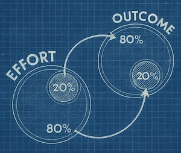
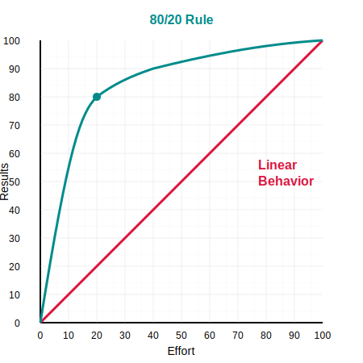

# From MVP to V1.0: The Horror of the Pareto Principle in Product Development
Why the Hardest Part of Building a Product Comes After Your Stakeholders Think You’re Done

## 🌱 Pea Pods: The Curious Roots of the Pareto Principle

### It all started, they say, with peas.

In the late 19th century, Italian economist Vilfredo Pareto was strolling through his garden when he noticed something peculiar: a small number of his pea plants were producing the majority of his pea pods. This uneven productivity sparked a thought — was this just a quirk of his garden, or was it something deeper?

Whether the garden anecdote is fact or fable, what's beyond dispute is that in 1896, Pareto published *Cours d'économie politique*, a foundational work in economics that revealed a striking pattern: roughly 20% of the Italian population owned about 80% of the land. He didn't stop there. As he examined other countries and other data, the same kind of disproportionate distribution kept appearing. A small number of causes, inputs, or actors seemed to generate a large portion of outcomes.

Pareto had stumbled upon a universal pattern — a principle of imbalance. Though he never named it himself, this idea later became canonized as the **Pareto Principle** (or more colloquially, the **80/20 Rule**) by quality pioneer Joseph M. Juran in the 1940s, who used it to spotlight the "vital few" causes behind most problems.

### The Pareto Principle in Modern Practice

Fast forward to the modern era, and this elegant observation has become a beloved compass for managers, engineers, and IT strategists. 

It's everywhere:

- 20% of features deliver 80% of user value.
- 20% of bugs cause 80% of production incidents.
- 20% of users generate 80% of support requests.

In a world overwhelmed by data and complexity, the Pareto Principle doesn't just help us understand systems — it helps us prioritize within them.

## 🚀 MVPs and the Art of Doing Less (But Smarter)

If Pareto were alive today, there's a good chance he'd be an MVP evangelist.

At the core of the Minimum Viable Product lies a question that every product team has wrestled with: What’s the smallest thing we can build that still delivers real value? And the best answers to that question almost always dance to the rhythm of the Pareto Principle.

A well-designed MVP isn’t just “minimal” — it’s strategically minimal. It’s not about doing less for the sake of it, but about doing the right 20% — the part that unlocks 80% of the learning, value, or user delight. It’s a deliberate, high-leverage move.

Think of it this way:

- Instead of building the full enterprise feature suite, we launch with the single workflow that 80% of users care about.
- Instead of integrating with ten systems, we start with the one that's mission-critical.
- Instead of perfecting scalability, we focus on proving desirability.

This isn't laziness — it's laser focus. It's not shipping scraps — it's shipping the essence.

And just like Pareto’s observations showed that disproportionate value often comes from a small input set, MVP thinking guides us to cut through the noise, to find the signal that really matters.

The irony? Doing less is hard. It requires discipline. It demands prioritization. But when done right, it pays off with clarity, faster feedback, and momentum. You’re not just testing your product—you’re testing your thinking.

So next time you're scoping your MVP, channel your inner Pareto:

- **Find** the 20% that matters
- **Ship** it
- **Learn** fast
- **Evolve** smart

## 🧱 From MVP to v1.0 — Welcome to the 80% Zone

So, the MVP is done.
It’s lean. It’s live. It’s learning.
You’ve nailed the vital 20% that proves the concept and delivers real value.
Bravo! 🎉

But now comes the mountain behind the hill: building Version 1.0.

Here’s the trap many fall into — they assume that, having built the MVP, they’re “almost there.” After all, how hard can the rest be?

Pareto would politely disagree.

If the MVP captured the first 20% of effort that delivered 80% of early impact, then moving to v1.0 means tackling the remaining 80% of the effort to close the final 20% of completeness. And this isn’t just polish — it’s foundational, operational, and often invisible to end users.

This is where the real engineering begins.
Where compliance wakes up.
Where complexity blooms.

Here's what that 80% typically includes:

- ✅ **User management**: Proper registration, login, password recovery, role-based access control, 2FA…
- ✅ **Support tooling**: Admin dashboards, audit logs, ticket export, impersonation modes…
- ✅ **Legal compliance**: GDPR privacy policy, cookie consent banners, terms of service, imprint pages…
- ✅ **Security hardening**: Input validation, rate limiting, encryption-at-rest, XSS/CSRF protection, secure headers…
- ✅ **Data resilience**: Backups, restore workflows, high availability configurations, monitoring & alerts…
- ✅ **Observability**: Logs, metrics, tracing, health checks, uptime dashboards…
- ✅ **Accessibility**: Keyboard navigation, screen reader support, WCAG compliance…
- ✅ **Internationalization**: Language files, date/time localization, right-to-left support…
- ✅ **Browser and device testing**: Responsive layouts, legacy browser fallbacks, performance tuning…
- ✅ **Upgrade paths**: Schema migrations, versioned APIs, rollback plans…
- ✅ **Documentation**: Internal architecture docs, API specs, user guides, onboarding checklists…

And that’s not even counting the human layers: change management, onboarding of new teams, setting up support processes, or implementing CI/CD pipelines robust enough to handle production traffic.

In short: MVP gets you on the field. v1.0 keeps you in the game.

Understanding this delta is vital for leadership, product owners, and stakeholders alike. It prevents unrealistic timelines and keeps everyone grounded in the true cost of readiness. It reminds us that MVP is not the first half of the journey — it’s more like the first foothold on a much larger climb.

So as you prepare for that climb, don’t be surprised when effort multiplies. That’s not failure. That’s Pareto in action.

## 🔥 The Cliff Between Wow and Work: When the Real Grind Begins

You've launched the MVP.\
The feedback is rolling in.\
The energy is electric.\
You're in the game.

Now — the market opens up.\
Sales is warming up their pitches.\
Marketing is sharpening its messaging.\
Investors start asking for forecasts.\
Your leadership team, buzzing from early wins, is ready to go full throttle.

And then… you pull the handbrake.

Suddenly, instead of weekly releases that demo new features, clever algorithms, and AI-powered delights, you're shipping:

- Cookie consent pop-ups.
- A forgotten-but-mandatory "Forgot Password" flow.
- That SAML SSO login for one enterprise pilot.
- Zendesk integration for the support team.
- Data retention policies and log rotation scripts.

No standing ovations. No high-fives. No tweets.

This is the moment where the **emotional Pareto Principle** hits:

> You've delivered 80% of the visible "wow" with 20% of the effort.
> Now you must deliver the invisible, boring, essential 20% — and it takes 80% of the effort.

To leadership, this phase is unnerving.\
From the outside, it looks like the product is stalling right when it should be skyrocketing. The chart stops curving up. The roadmap looks empty. What was once fast becomes slow. Weeks go by with no "wow" to show.

Worse: they’re watching milestones slip just as they promised revenue to stakeholders.

Inside the team, morale can dip.\
This isn’t the fun part.\
No genius breakthroughs, no machine-learning milestones, no war stories for beers at the end of the sprint.\
Just diligent plumbing: compliance checklists, infrastructure upgrades, edge-case validations, stale Jira tickets coming home to roost.

And sometimes, it gets even harder.

Maybe the architecture that served your MVP just fine… buckles under real-world load.\
Maybe you discover your naive job queue can’t scale past 5 customers.\
Maybe you need to swap out core services, or rewrite internal protocols.\
Refactor. Migrate. Harden.

And none of this makes sexy headlines.

It’s in this phase — this “death valley” between MVP and version 1.0 — where many product teams lose their way, and many execs lose their nerve. The product doesn’t feel like it’s evolving — even though the team is working harder than ever.

It feels like stalling at the very moment you need to accelerate.

But here's the twist:

**This is not failure.**\
**This is the necessary cost of turning potential into reality.**\
**This is what maturity looks like in the software lifecycle.**

The key is knowing it’s coming — and preparing everyone for it.

## 🛠️ Surviving the Death Valley — Four Field-Tested Recommendations

So, what can you do?

How do you keep your product on track, your team motivated, and your stakeholders calm — while trudging through the dull but critical terrain between MVP and v1.0?

You acknowledge the terrain — and then you equip yourself to cross it.\
Here are four strategic moves that have made all the difference in the real world:

⸻

### 1. 📣 Educate Your Stakeholders Early — and Often

Don't let the "valley" come as a surprise. Most stakeholders — especially outside of IT — haven't lived through this phase before. They've seen demos, heard pitches, and are ready to press the gas.

Tell them what's coming.\
Explain the 80/20 asymmetry of the MVP vs. v1.0 workload.\
Show them where the effort goes — security, compliance, monitoring, legal, infrastructure.

Make this phase visible in your roadmaps.\
Give it a name. Talk about it in kickoff meetings.\
Normalize it.\
Because when people know the climb is coming, they pack better.

⸻

### 2. 🚫 Declare a Feature Freeze — and Mean It

Once the MVP is defined, lock the scope. This sounds easy. It's not.

As your sales team starts landing early customers, you'll be flooded with "just this one feature" requests — many of them great ideas. Some will even sound like deal-breakers. "They won't sign unless we add this one toggle." We've all heard it.

But say yes once — and the death valley stretches out like a desert.\
Each feature starts a new 20/80 cycle.\
You don't just add a button — you add maintenance, tests, edge cases, support questions, GDPR implications.

So here's the rule:\
New features go in v2.0.\
Until v1.0 is out, everything else is stabilization.

Yes, it's painful.\
Yes, it takes discipline.\
But it's what makes a product survive.

⸻

### 3. 🏗️ "Minimal" Doesn't Mean "Crap Code"

Remember: MVP means Minimal Viable Product. That minimality applies to the feature set, not to engineering discipline.

So while you're cutting down on surface area, don't compromise on foundation.\
Use the right language.\
Don't mock your own architecture.\
Set up real logging and monitoring.\
Use scalable patterns.\
Start with Infrastructure as Code.\
Use feature flags.\
Internationalize early — even if you're launching in one country.\
Don't hardcode hacks "just for now."

The MVP is the fastest way to market — but make sure it's the right vehicle to reach v1.0, not something you'll need to junk and rebuild.

⸻

### 4. 💰 MVP Is What Gets Paid For — Not What Gets Demoed

This one's subtle — but critical.

Sometimes, management calls a pilot implementation "the MVP."\
Because it looks viable. It feels complete. The CEO likes it. The investor smiled.

But that's not an MVP. That's a Pilot.\
A prototype. A simulation of potential.\
And the danger here is mistaking internal excitement for external validation.

Now here comes the real trap:

> 🔥 The path from Pilot to v1.0 is often even more brutal than the MVP to v1.0.

Take it from Steve Blank's book "The Four Steps to the Epiphany":

> "A product is only viable when a customer has paid for it."

Money is the ultimate validator.\
Until someone exchanges value, your product is still pre‑viable.

So: resist the temptation to celebrate too early.\
Define "viable" by revenue, not applause.\
And only then move forward with the confidence of real traction.

⸻

## 🎯 Final Thoughts: MVPs Are the Start — Not the Shortcut

The Pareto Principle taught us that the first 20% of effort can unlock 80% of value.\
But it also warns us: the remaining 80% of effort is where real products are forged.

Going from MVP to v1.0 is a test of engineering, yes — but it's also a test of leadership, focus, and resilience.

Prepare your stakeholders.\
Guard your scope.\
Build foundations, not hacks.\
And always define success in real-world terms: working code, paying customers, sustainable growth.

Because when you reach v1.0 — with your product hardened, your team intact, and your customers still happy — that's not just a version number.

That's a battle-tested, market-ready business.

