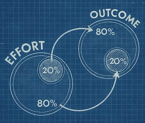
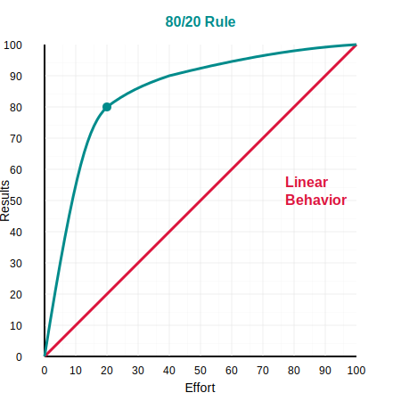

# From MVP to V1.0: The Beautiful Horror of the Pareto Principle in Product Development
*Why the Hardest Part of Building a Product Comes After Everyone Thinks You're Done*

## 🌱 The Garden Where It All Began

Picture this: An Italian economist, wandering through his garden in the late 1890s, stops to examine his pea plants. Most are struggling along, producing a pod here and there. But a handful? They're absolutely thriving, heavy with pods, practically showing off.

This moment—whether historical fact or charming fiction—sparked one of the most profound observations in modern thinking.

Vilfredo Pareto noticed something that would haunt and guide entrepreneurs for the next century: **imbalance is the natural state of the universe**. When he turned from his garden to his economic research, the pattern emerged everywhere. In Italy, 20% of the population owned 80% of the land. In Britain, similar. In Russia, the same dance of disproportion.

He'd discovered a universal truth hiding in plain sight—a principle so elegant and so brutal that it would reshape how we think about everything from wealth distribution to software development.

Joseph Juran would later canonize this as the **Pareto Principle**, though most of us know it by its catchier name: **the 80/20 Rule**.

### Why This Ancient Principle Is Your Modern Superpower

Today, this observation from a 19th-century garden has become the secret weapon of every smart product team:

- **20% of your features** will delight 80% of your users
- **20% of your code** will cause 80% of your headaches  
- **20% of your customers** will generate 80% of your revenue
- **20% of your effort** will produce 80% of your impact

But here's where it gets interesting—and where most teams get it wrong.

## 🚀 The MVP: Your Love Letter to the 20%

If Pareto walked into a modern startup accelerator, he'd feel right at home. The Minimum Viable Product isn't just a buzzword—it's the Pareto Principle weaponized for the digital age.

Think about what an MVP really asks: *What's the smallest thing we can build that still makes someone's day better?*

The answer is never "everything." It's never even "most things." It's that magical 20%—the features that make 80% of users say, "Yes, this. This is what I needed."

A brilliant MVP is like a perfectly distilled espresso shot. It's not watered down—it's concentrated. It's not incomplete—it's essential. Every feature earns its place. Every line of code fights for its life.

Consider how the masters do it:

- **Dropbox** didn't start with enterprise features, versioning, or team folders. Just one folder. That syncs. Everywhere.
- **Twitter** didn't launch with threads, polls, or spaces. Just 140 characters of pure human connection.
- **Airbnb** didn't begin with instant booking, superhosts, or experiences. Just air mattresses and breakfast.

Each found their 20%. Each changed the world.

But here's the beautiful trap—and it's one every product team falls into: **Success with the 20% makes you think the remaining 80% will be easy.**

*Spoiler: It won't be.*

## 🏔️ The Mountain Behind the Hill

Picture this scene (you've probably lived it):

The MVP launch was perfect. Users love it. The team is high-fiving. Leadership is talking about hockey stick growth. The future is bright, the path is clear, and everyone's ready to sprint to v1.0.

Three months later? 

The energy has evaporated. The team looks exhausted. Leadership is asking why nothing "new" has shipped. The roadmap looks like a graveyard of boring infrastructure tasks.

Welcome to what I call **The 80% Zone**—where dreams go to get debugged.

If your MVP captured that first 20% of effort for 80% of the value, then v1.0 means tackling the inverse: 80% of the effort for that last, crucial 20% of completeness.

And this isn't decoration. This is the difference between a demo and a business. Between a prototype and a product. Between something that works on your laptop and something that works in the real world.

### The Unsexy Shopping List of Success

Here's what that 80% actually looks like (brace yourself):

**The User Management Marathon:**
- Registration that actually works
- Password recovery (because everyone forgets)
- Two-factor authentication (because security)
- Role-based access (because not everyone should see everything)
- Session management (because tokens expire)

**The Compliance Gauntlet:**
- GDPR privacy policies that lawyers approve
- Cookie consent banners that users ignore
- Terms of service that no one reads
- Data deletion workflows that everyone needs

**The Security Fortress:**
- Input validation (because users are creative)
- Rate limiting (because bots are real)
- SQL injection prevention (because 1990 called)
- XSS protection (because JavaScript is everywhere)
- CSRF tokens (because trust no one)

**The Operational Reality:**
- Monitoring that actually alerts you
- Logs that actually help debug
- Backups that actually restore
- Documentation that actually documents
- Tests that actually test

**The Human Experience:**
- Accessibility (because everyone deserves access)
- Internationalization (because the world is bigger than Silicon Valley)
- Mobile responsiveness (because it's not 2007)
- Browser compatibility (because IE still exists somewhere)

None of this makes for a thrilling sprint demo. None of this gets retweets. But all of it—every single boring line—is what transforms your brilliant idea into a sustainable business.

## 🔥 The Emotional Cliff Nobody Warns You About

Here's where it gets psychologically brutal.

You've just spent three months building the coolest features, solving interesting problems, shipping weekly wins. The dopamine hits were regular. The progress was visible. Everyone could see the product taking shape.

Now? You're shipping:
- Password reset emails
- Cookie banners
- Audit logs
- Rate limiters
- Database migration scripts

The contrast is jarring. It's like going from composing symphonies to tuning pianos. Both are necessary for beautiful music, but only one gets the spotlight.

**For leadership**, this phase is bewildering. "Why has development slowed down?" they ask, not seeing the iceberg of infrastructure beneath the surface. They were promised hockey sticks, not plateaus.

**For developers**, it's demoralizing. No more clever algorithms or elegant solutions. Just plumbing. Endless, critical plumbing. The kind of work that's only noticed when it breaks.

**For product managers**, it's exhausting. Try explaining to stakeholders why the next three sprints are dedicated to "technical debt" and "platform stability." Watch their eyes glaze over.

This is the **Death Valley** of product development—where momentum goes to die and dreams get stress-tested by reality.

But here's the secret that separates successful products from beautiful failures:

**This isn't where products die. This is where products are born.**

The MVP was conception. This is the actual labor.

## 🛠️ Your Survival Guide for the 80% Zone

After shepherding dozens of products through this valley, here's what actually works:

### 1. 📣 Make the Invisible Visible

Start talking about the 80% Zone before you even build the MVP. Give it a name in your roadmap. Put it on slides. Make it a celebrated phase, not a surprise crisis.

Create a "Journey to v1.0" visualization that shows:
- The exciting MVP features (the peak)
- The essential infrastructure work (the valley)  
- The sustainable business on the other side (the promised land)

When stakeholders see it coming, they pack patience instead of panic.

### 2. 🚫 The Sacred Art of Saying No

The moment your MVP succeeds, everyone will have "just one small feature" to add. Your sales team will swear deals depend on it. Your investors will have strong opinions. Your users will send heartfelt requests.

Here's your mantra: **New features are v2.0 problems.**

Every feature you add during the 80% Zone doesn't just add development time—it multiplies it. That innocent toggle switch needs:
- UI design
- Backend logic
- Database changes
- API updates
- Documentation
- Tests
- Security review
- Accessibility consideration
- Internationalization
- Support training

Protect your scope like your life depends on it. Because your product's life does.

### 3. 🏗️ Build Your Foundations in Stone, Not Sand

"Move fast and break things" is a luxury for companies that aren't carrying real user data and real user trust.

Your MVP can be minimal in features, but it should never be minimal in craftsmanship:
- Choose boring, proven technology
- Instrument everything from day one
- Make your logs verbose (you'll thank yourself later)
- Design for 10x your current load
- Assume everything will fail (because it will)
- Write tests for the critical paths
- Document your decisions (future you will forget)

Technical debt isn't just about code quality—it's about the compound interest you pay on every shortcut, forever.

### 4. 💰 Revenue Is the Only Reality Check That Matters

Here's a truth that stings: That successful pilot with glowing feedback? That's not an MVP. That's a science experiment.

Real validation comes with invoices, not applause. As Steve Blank reminds us: **"You don't have a product until someone pays for it."**

The path from "they love it" to "they'll pay for it" often requires all that boring 80% work:
- Enterprise SSO for that Fortune 500 pilot
- SOC2 compliance for that security-conscious customer
- Uptime SLAs for that mission-critical use case
- GDPR compliance for that European expansion

Money isn't just validation—it's permission to build the real thing.

## 🎯 The Beautiful Truth About Building Products

The Pareto Principle isn't just an observation—it's a promise and a warning wrapped in mathematical elegance.

**The promise:** You can create remarkable value with focused effort. That first 20% isn't just possible; it's powerful. Your MVP can change everything.

**The warning:** The last 20% will cost you 80% of your effort, patience, and sanity. But it's not optional. It's the price of admission to the game you're trying to win.

Building products isn't about avoiding the 80% Zone—it's about approaching it with eyes wide open, team prepared, and expectations calibrated.

Because when you emerge on the other side—battle-tested, infrastructure-solid, compliance-ready—you don't just have a product.

**You have a business.**

And that transformation, from clever prototype to sustainable solution? That's where the real magic happens. Not in the exciting sprint to MVP, but in the disciplined march to v1.0.

So embrace the grind. Celebrate the boring. Document the invisible.

Because every overnight success is built on a foundation of forgotten afternoons spent writing error handlers, configuring build pipelines, and arguing about password complexity requirements.

**The garden that Pareto walked through gave us more than a principle. It gave us a map.**

Now go build something that lasts.

---

*Remember: The hardest part of building a product isn't having a great idea. It's having the discipline to build all the parts nobody sees—and the wisdom to know they matter most.*