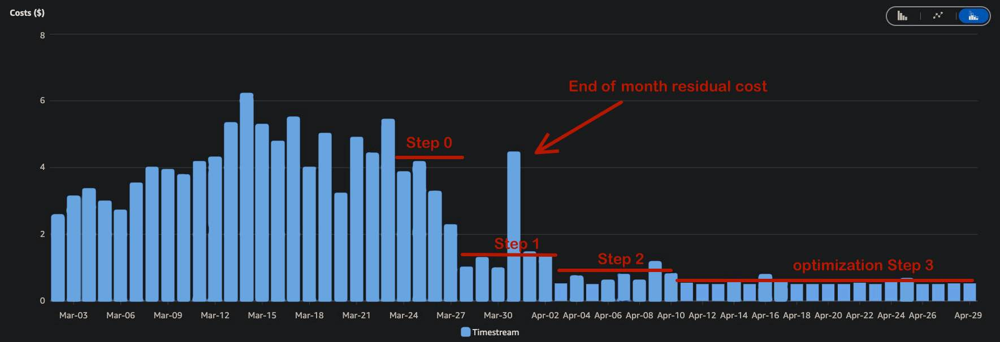
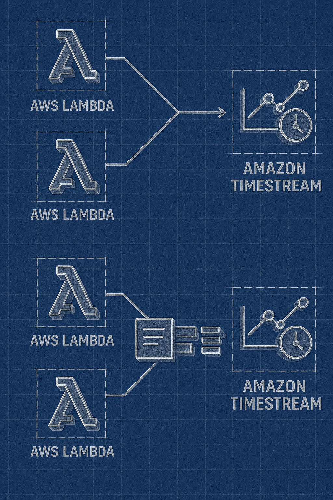
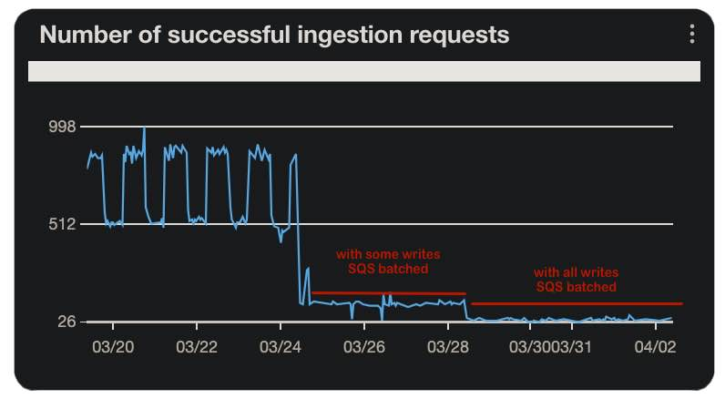
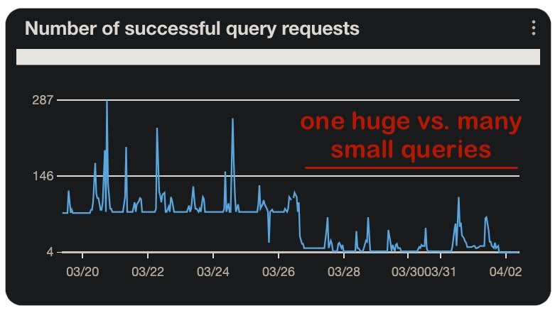

<meta name="title" content="Optimizing Timestream for Cost Efficiency">
<meta name="description" content="A case study on how to analyze and reduce AWS Timestream costs by optimizing ingestion and query patterns, with practical examples and code snippets.">
<meta name="keywords" content="AWS, Timestream, cost optimization, serverless, Lambda, SQS, data ingestion, query optimization, cloud, database">
<meta property="og:title" content="Optimizing Timestream for Cost Efficiency">
<meta property="og:description" content="A case study on how to analyze and reduce AWS Timestream costs by optimizing ingestion and query patterns, with practical examples and code snippets.">
<meta property="og:image" content="./optimize_timestream/banner.png">
<meta property="og:type" content="article">
<meta property="article:published_time" content="2025-05-18">

# Optimizing AWS Timestream for Cost Efficiency


In my current pilot project, the goal is to process sensor data in the cloud efficiently and nearly in real-time. Each sensor sends a measurement every 15 minutes via MQTT, which is written directly into AWS Timestream by an AWS Lambda function at the exact moment it is received—ad hoc and precisely timed, with no buffering or batch processing. The data is used in two scenarios: first, hourly aggregation calculates averages for customer-facing displays; second, users can access the complete time series — e.g., the past 30 days—at any time through a web interface.

To get started quickly, we deliberately chose a simple architecture: every individual measurement is processed and stored immediately upon arrival. However, after a short time — and with just 70 installed sensors — our monthly Timestream costs unexpectedly climbed into the triple-digit dollar range. Given our intended cost - sensitive pricing model, this was unsustainable.



So we analyzed how Timestream is used and billed: which actions drive costs the most? What optimization strategies can reduce storage expenses without compromising data functionality or freshness? In this article, I’ll walk you through where the cost traps were and what steps we took to significantly reduce operating expenses.
# Monitoring what is going on

Before diving into optimization, we first needed a clear picture of what was actually happening inside our Timestream setup. Fortunately, AWS provides out-of-the-box monitoring capabilities that give you a fast, no-fuss starting point—no need to set up custom dashboards.

### Using Built-in Monitoring in the AWS Console

Instead of building custom CloudWatch dashboards, we simply navigated to:

**AWS Console → Amazon Timestream → Monitoring (left sidebar)**

This view already includes the most important predefined metrics, which are perfectly sufficient for identifying the biggest cost drivers.

The two key metrics we focused on were:

- **Number of successful ingestion requests**  
    This reflects how many write operations hit the database per time unit.

- **Number of successful query requests**  
    This shows how often data is read — typically driven by dashboards, APIs, or analytic jobs.

### What We Learned

These metrics gave us a surprisingly clear picture right away:

- The ingestion rate was continuously high.
- The query rate peaked during working hours, consistent with users checking dashboards or exporting data.

This first glance at Timestream’s own monitoring already revealed a pattern: we were generating a lot more ingestion and query operations than anticipated, even with a relatively small sensor fleet.

By correlating the volume of successful requests with the pricing model (Timestream charges per write, per GB read, and per GB stored), it was obvious: our cost issue wasn’t due to storage — it was the sheer number of operations.

💡 **Quick takeaway:** AWS’s built-in Timestream Monitoring is a simple and effective way to get started. For quick insights, there’s no need to dive into CloudWatch dashboards or enable CloudTrail — just go to the Timestream UI and check the graphs.


📝 **Note on Ingestion Overhead:** AWS Timestream accounts for a minimum of 1 KB per ingestion, regardless of the actual payload size.
That means writing a single float (4 bytes) or boolean (1 bit) per request will cost you ~200× more in traffic than the data you actually send.

💡 **Implication:** Frequent writes of tiny payloads are extremely inefficient and should be batched whenever possible.

Armed with this understanding, our first target was clear: the ingestion pattern. That’s where the bulk of the costs came from — and that’s what we optimized first.


# Optimizing Ingestion Costs with Bulk Writes

### The Problem: Inefficient Single-Record Writes

Each ingestion into Timestream is billed at a minimum size of 1 KB, regardless of the actual payload size. This means writing a single sensor value—such as a 4-byte float or a 1-bit boolean—results in significant overhead, making frequent writes of small payloads highly inefficient and costly.

### The Solution: Bulk Writing with Timestream

To address this inefficiency, we implemented bulk writing. Timestream allows up to 100 records per `WriteRecords` API call, enabling substantial cost savings by reducing the number of write operations.

### The Challenge: Stateless Serverless Architecture

Our architecture posed a challenge: the Lambda function connected to the MQTT broker processes one sensor reading per invocation. Without a stateful process to accumulate data, there was no natural way to batch sensor readings.

### The Fix: Introducing Amazon SQS as a Buffer

We solved this by introducing an Amazon SQS queue as a decoupling layer between the ingestion point and the database write process. 



Here’s how it works:

1. **Decoupling ingestion:** The original Lambda function no longer writes directly to Timestream. Instead, it sends each sensor reading to an SQS queue.
2. **Batch processing:** A second Lambda function is triggered in batch mode by the SQS queue (e.g., processing up to 20 messages per invocation).
3. **Bulk writes:** This second Lambda groups the incoming sensor readings and performs a single bulk `WriteRecords` operation to Timestream.

Here is a simplified code snippet of the collecting lambda illustrating this approach:
```ts
function handler(event: SQSEvent) {
  // Collect all records from SQS event
  let bulkInsert = [];

  for each message in event.records {
    let sensorData = parse(message.body);
    bulkInsert.addAll(sensorData);
  }

  // Optional: sort by timestamp
  bulkInsert.sortByTimestamp();

  // Optional: log total size
  log("Bulk payload size in bytes:", calculateSize(bulkInsert));

  // Validate timestamps
  for each item in bulkInsert {
    if (item.timestamp is too old or in the future) {
      warn("Suspicious timestamp:", item);
    }
  }

  // Write to Timestream in one batch
  try {
    timestream.write(bulkInsert);
    log("Successfully wrote", bulkInsert.length, "records to Timestream");
  } catch (error) {
    if (error is RejectedRecordsException) {
      for each reason in error.reasons {
        warn("Rejected due to", reason);
      }
    } else {
      error("Unexpected error:", error);
    }
  }
}
```
## Configuring the Batch Trigger in CDK

To enable bulk processing, we used Amazon SQS as the trigger source for the Lambda function responsible for writing to Timestream. With AWS CDK, this configuration is straightforward:

```ts
tsBulkerLambda.addEventSource(new SqsEventSource(queue, {
    batchSize: 20, // Max number of messages per Lambda invocation
    maxBatchingWindow: cdk.Duration.seconds(5 * 60), // Wait up to 5 minutes
}));
```

### Explanation of Parameters

- **`batchSize: 20`**  
    The Lambda function will process up to 20 messages in a single invocation.

- **`maxBatchingWindow: 5 minutes`**  
    If fewer than 20 messages arrive, the Lambda will wait up to 5 minutes before invoking.

These parameters are the primary controls for tuning your bulk ingestion pattern.

⚖️ **Trade-Off: Cost vs. Latency** Bulk writing significantly reduces ingestion costs but introduces a delay between sensor data arrival and its persistence in Timestream. The larger the batch size or the longer the wait window, the more efficient your writes—but also the higher your pipeline latency.

💡 **Balance carefully:** In our case, a few minutes of delay was acceptable since our dashboards refresh hourly and do not require second-level precision. However, if your use case demands real-time updates, consider reducing the `maxBatchingWindow` to minimize latency.

By implementing this pattern, we achieved a significant reduction in ingestion costs while maintaining the functionality and reliability of our system.



# Optimizing Query Costs with Bulk Reads
Just like writing, reading from Timestream can become surprisingly expensive—especially when the same data is queried frequently or in small fragments. Timestream charges based on the amount of data scanned, not the size of the result. This means multiple simple queries that each scan small overlapping time windows can quickly snowball into a major cost driver.

In our architecture, we run a scheduled Lambda every hour to calculate KPIs and update customer-facing dashboards. Since this job is deterministic and predictable, we applied the same bulk principle used for writing—this time to reading.

Here’s how we optimized our query strategy:

1. **Define the required data upfront:** We identified the time range and data series needed for the full calculation pass.
2. **Consolidate queries:** Instead of querying Timestream on demand for each value or device, we constructed a single, consolidated SQL query to fetch all necessary records across devices and timeframes.
3. **Use in-memory processing:** The resulting dataset was parsed and loaded into an in-memory hashmap, keyed by `deviceId`, `measureName`, and `timestamp`.
4. **Minimize repeated queries:** All subsequent calculation steps accessed the hashmap instead of querying Timestream repeatedly.

This approach turned potentially hundreds or thousands of small queries into one well-scoped, efficient read. As a result, we significantly reduced:

- **Data scanned:** Consolidating queries minimized the total amount of data scanned.
- **Execution time:** The Lambda function’s cold-start and processing time decreased due to fewer query operations.

💡 **Tip:** Timestream charges you per data scanned, not per query. A single complex query scanning 10 MB is cheaper than 100 small queries each scanning 500 KB.

### Trade-Offs and Considerations

This method works best when:

- **Data access patterns are predictable:** You know in advance what data is needed for processing.
- **Sufficient memory is available:** The Lambda function must have enough memory to hold the full dataset in-memory during execution.

If these conditions are met, bulk reading is highly cost-efficient and performant.

### Alternative: Reactive Query Batching for Dynamic Workloads

If your workload is unpredictable — for example, queries are driven by user interactions or multiple components accessing overlapping data — you’ll need a more reactive, demand-driven strategy. In such cases, consider a **“deferred fan-in with fan-out”** pattern:

1. **Deferred fan-in:** Multiple components register their data requirements over time.
2. **Batching trigger:** A timer, threshold, or debounce window collects these requirements.
3. **Single combined query:** A consolidated query is executed to fetch all required data.
4. **Fan-out results:** The results are distributed to the original requesters, who receive only the portion they need.

This pattern avoids redundant queries while maintaining flexibility for dynamic environments like dashboards, APIs, or user-triggered exports.

- **Predictable workloads:** Use preloading and caching with bulk reads.
- **Dynamic workloads:** Use reactive batching to optimize query efficiency.

By adopting these strategies, we reduced query costs while ensuring our system remained responsive and scalable.



Either way, the takeaway is clear: query Timestream as rarely and as efficiently as possible.

# Two Additional Cost Optimization Strategies

Before wrapping up, here are two additional tactics we implemented that significantly reduced our Timestream and API-related costs — especially useful in production scenarios with real-world usage patterns and long-term retention strategies.

---

### 1. HTTP Caching for Public APIs

While we had control over how our backend services interacted with Timestream, we had no control over how frequently customer UIs would call our public-facing API. Some clients hit the data endpoint every few seconds, even when the data hadn’t changed.

To address this, we added the following HTTP response header to all relevant endpoints:

```http
Cache-Control: public, max-age=3600, immutable
```

This instructs compliant browsers and intermediary caches (like CDNs) to:

- Cache the response for up to 1 hour (`max-age=3600`).
- Treat the response as immutable, meaning it doesn’t need revalidation unless absolutely necessary.

💡 **Why it helps:**  
This drastically reduces backend load, Lambda invocations, and — most importantly — read operations to Timestream, especially if the data is only updated hourly.

**Result:** Our Lambda and Timestream read metrics dropped significantly, with no impact on user experience.

---

### 2. Managing Timestream’s Memory vs. Magnetic Storage

AWS Timestream uses a two-tier storage model:

- **Memory Store:** Fast! You can write to Memory only.
- **Magnetic Store:** Long-term, durable, and optimized for historical queries — but significantly slower to read from.

#### Key Insights:

- Data is always ingested into the Memory Store first.
- You can control how long data stays in Memory before being moved to Magnetic storage.

#### 🛠️ Optimization Tip:

Carefully review your Timestream table retention settings. If your queries rarely require historical data, minimize the Magnetic retention window to reduce long-term costs.

---

### Bonus: Archive to S3 for Long-Term Storage

If you need to retain historical data for months or years, Timestream may not be the most cost-effective solution.

✅ **Alternative:** Export old records to S3 in Parquet format and use Athena or Glue for querying.

This approach provides:

- **Low-cost, long-term storage.**
- **Analytical query capabilities** without incurring Timestream read costs.
- **Lifecycle management options** (e.g., Glacier for cold archiving).

By combining these strategies, we achieved a sustainable cost structure while maintaining system performance and data accessibility.
Of course! Here is the conclusion rewritten in narrative form, without bullet points, while maintaining clarity and technical depth:

⸻

# Conclusion

AWS Timestream offers an elegant and scalable way to handle time series data in the cloud. However, as we experienced first-hand, even a small-scale deployment with just 70 sensors can lead to unexpectedly high operational costs if left unoptimized. What initially began as a simple and agile setup—real-time ingestion with on-demand querying—quickly revealed its inefficiencies when examined through the lens of actual billing data.

Through careful analysis and targeted redesign, we were able to transform our architecture into a far more cost-effective and robust system. By introducing SQS as a buffering layer and implementing bulk writes, we dramatically reduced ingestion overhead. Similarly, by consolidating our read patterns into single, predictable queries and caching the results in memory, we avoided the trap of repetitive and costly micro-queries. Beyond that, enabling HTTP caching on our public API endpoints helped us mitigate unpredictable usage patterns from clients, while tuning Timestream’s retention policies ensured that we weren’t paying for magnetic storage we didn’t truly need.

These changes not only brought our costs down to a sustainable level—they also improved system resilience, scalability, and performance. Perhaps the most important lesson is that Timestream, while powerful, isn’t a plug-and-play database. It demands an understanding of its pricing model and behavior patterns. When those are taken into account, it becomes a highly efficient tool for real-time and near-real-time analytics.

Ultimately, optimizing Timestream is not about compromise—it’s about making deliberate, informed decisions that align with the actual requirements of your system. With the right architecture, it’s possible to enjoy the full benefits of time series processing without the financial surprises.

---

# References and Further Reading
## AWS Official Documentation & Blogs
- **[Understanding and optimizing Amazon Timestream Compute Units for efficient time series data management](https://aws.amazon.com/blogs/database/understanding-and-optimizing-amazon-timestream-compute-units-for-efficient-time-series-data-management/)** – *AWS Database Blog (2024)*  
  Introduces Timestream’s new pricing model based on Timestream Compute Units (TCUs), and how to cap them for budget control.

- **[Improve query performance and reduce cost using scheduled queries in Amazon Timestream](https://aws.amazon.com/blogs/database/improve-query-performance-and-reduce-cost-using-scheduled-queries-in-amazon-timestream/)** – *AWS Database Blog (2023)*  
  Demonstrates use of Scheduled Queries and multi-measure records to pre-compute results and reduce read costs.

- **[Patterns for AWS IoT time series data ingestion with Amazon Timestream](https://aws.amazon.com/blogs/database/patterns-for-aws-iot-time-series-data-ingestion-with-amazon-timestream/)** – *AWS Database Blog (2021)*  
  Outlines ingestion patterns for IoT telemetry and compares Lambda, Kinesis, and SQS setups for cost-efficiency.

## Community and Case Studies

- **[Three Cost-Effective Design Patterns for AWS IoT Data Ingestion](https://www.trek10.com/blog/three-cost-effective-design-patterns-for-aws-iot-data-ingestion)** – *Trek10 (2021)*  
  Compares Lambda, SQS, and Kinesis patterns for ingesting data, with cost-performance tradeoffs.


