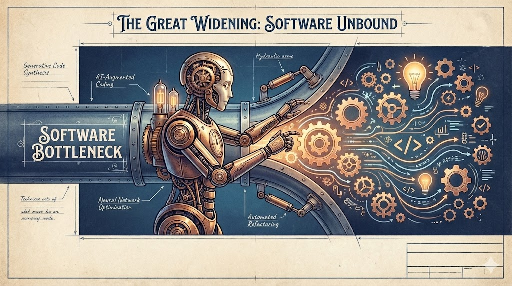

# When AI Writes the Code, Software Stops Being the Bottleneck
*The real impact of AI coding isn't faster delivery — it's what becomes possible to build*

*"Within months, AI will write the majority of software code — and within a year, essentially all of it."*

That's not a random tweet from a tech hype account. That's Dario Amodei, CEO of Anthropic, making a prediction that would have sounded absurd just two years ago.

When I first heard this, my reaction was predictable: curiosity, skepticism, and the quiet confidence that reality would remain more complicated than the prediction. Most engineers I know felt the same.

But as 2025 evolved, something uncomfortable became visible: he might actually be right.

If this trajectory holds, yes — the software industry will transform. Tools, roles, hiring, education, all of it.

But I believe the **far bigger consequence** lies elsewhere: in every business that has ever struggled to get software built.

---

## The Bigger Change: Software Stops Being the Bottleneck

Think about it: for decades, software development capacity has been one of the most consistent limiting factors across nearly every industry.

Not because companies lacked ideas. Not because the business case wasn't clear.

But because turning ideas into production-grade software was slow, expensive, coordination-heavy, and constrained by scarce talent.

This created a harsh economic reality I've seen over and over again in my career:

> Even when a better process is obvious, it often doesn't get implemented — because software delivery is too painful.

If AI truly pushes implementation cost and cycle time down by an order of magnitude, then software stops being the bottleneck. And once software is no longer scarce, organizations are forced to discover what their *real* constraints are.

That's where things get interesting.

---

## Digital at the Top, Manual at the Bottom

Here's a pattern I've observed repeatedly when looking inside large organizations:

Most enterprises have digitized their core business processes. ERP systems, CRM platforms, billing flows, procurement pipelines, reporting tools — the big value streams are usually mapped into software. From a distance, this creates the impression that enterprises are "already digital."

But if you look closer — especially at the product edge and day-to-day execution — a surprising amount of work is still manual or semi-manual.

**The gaps typically look like this:**

- Excel sheets used as workflow engines
- Manual decision points powered by tribal knowledge
- Email-based approvals and handoffs
- "Temporary" tracking lists that become permanent
- Cross-system copy/paste between exports and dashboards

These are not rare exceptions. They are structural.

Why? Because for decades, enterprises learned to classify improvements into two buckets:

1. **Big enough to justify software**
2. **Too small to justify the pain**

And in many cases, that second bucket is huge.

---

## Why the Long Tail Stayed Manual

A key reason this long tail stayed manual is that digitizing even *minor* process steps is expensive in a traditional enterprise environment.

I've seen this firsthand. Even if a use case is crystal clear, the typical sequence is painful:

- Define and align requirements
- Translate business intent into implementation detail
- Hand over to the software organization
- Back-and-forth clarification loops
- Schedule into roadmaps and release windows
- Integration work, security approvals, rollout planning

When delivery cycles operate in months — or worse, half-year release windows — the smallest workflow improvement starts looking like a major initiative.

So the organization rationally chooses the "cheap" alternative: manual execution, Excel-driven procedures, and local workarounds.

> The enterprise is digitized, but the operational layer still depends heavily on human glue work.

Sound familiar?

---

## Software Is Process Stability

Here's something that often gets overlooked: the impact of shifting away from manual workflows isn't only about speed. A well-designed software solution provides something manual processes rarely can:

**Repeatable, stable execution.**

Manual workflows are fragile:

- Results depend on the operator's experience
- Quality varies across teams, locations, and shifts
- Edge cases are handled differently depending on who's on duty
- Knowledge lives in people's heads, not in the system
- Changes break the workflow silently and unpredictably

Excel-driven workflows are especially deceptive. They *feel* structured, but they're optimized for "getting it done" — not for stability, auditability, or systematic error prevention.

Software changes that. It turns free-form execution into guided execution:

- Validations instead of "check manually"
- Guardrails instead of tribal knowledge
- Standardized outputs instead of individual interpretation
- Traceability instead of "who changed the sheet?"

And once you have that stability, an important second-order effect appears:

> Manual processes require highly skilled people to remain safe and consistent. Software allows less specialized personnel to execute steps reliably.

That doesn't devalue expertise — it relocates it. Instead of spending expert capacity on operational firefighting, organizations can use expertise where it actually matters: designing systems, improving workflows, and refining decisions.

---

## The Real Unlock: Continuous Improvement

There's another structural limitation I've observed that slow software delivery creates:

**Improvement happens in batches.**

Even in "modern" enterprises, software release cycles are often measured in weeks or months. And in many traditional environments, release cycles stretch to half a year.

The immediate effect on operations:

- Weaknesses are tolerated because change is expensive
- Workarounds become permanent habits
- Process flaws are documented — and then postponed
- Feedback loops collapse under slow iteration

And because iteration is slow, specifications have to be written with the assumption that the next chance to correct misunderstandings might only arrive months later. That naturally creates heavyweight requirement processes — not because companies love bureaucracy, but because when delivery is slow, **predictability becomes survival**.

Now imagine a different world:

- The executing team identifies a weakness in the workflow
- A software improvement is built within **hours or days**
- It's shipped safely into production
- Outcomes are observed and refined immediately

At that point, software stops being a periodic delivery function. It becomes a **live optimization layer for operations**.

> AI-augmented software development becomes far more important than "faster coding" — it enables continuous improvement in places where improvement was previously too expensive to justify.

### Kaizen Becomes Operational, Not Philosophical

This maps directly onto Kaizen: small, frequent improvements driven by execution feedback.

Kaizen has always been an attractive principle — but in many software-supported processes it remained constrained by delivery friction. If it takes months to implement an improvement, continuous improvement becomes hard to sustain.

With AI-accelerated delivery cycles, Kaizen becomes a practical operating model:

- Identify friction
- Implement change
- Validate outcome
- Repeat

Or in simple terms:

> When iteration becomes cheap, learning loops become affordable everywhere.

---

## And This Is Where the Real Industry Impact Begins

Once software stops being scarce inside companies, the broader consequences follow naturally.

Enterprises will no longer optimize around software scarcity. Instead, they'll start treating software as a flexible execution layer that can be shaped continuously around reality.

This changes competitive dynamics. Because if everyone can build software faster, the differentiator shifts away from implementation output.

**The value moves toward areas that cannot be brute-forced by code generation:**

- Domain understanding and modeling correctness
- High-quality data semantics and entity structures
- Integration into messy legacy environments
- Governance, compliance, and security constraints
- Operational excellence: monitoring, rollout strategy, incident response
- Decision-making: what to build, what to ignore, and why

> When software becomes abundant, the differentiator becomes judgment.

Not the ability to ship *something*. But the ability to ship the *right thing*, safely, repeatedly, and at scale.

---

## The Paradox: Cheaper Software, Costlier Responsibility

There's a final paradox worth considering.

Making software cheaper does not remove risk. It increases the number of things that can be changed. And with that, it increases the importance of:

- Robust architecture boundaries
- Test automation and system-level verification
- Rollback strategies and controlled deployments
- Observability, alerting, and root-cause clarity
- Operational readiness as a first-class engineering goal

Because the faster you can change systems, the faster you can break them.

So while AI reduces the friction of implementation, it forces organizations to upgrade how they govern change. The teams that thrive won't be those who generate the most code — they'll be those who build the most robust systems for validating and deploying it.

---

## Conclusion: The Bottleneck Doesn't Disappear — It Migrates

If the "AI writes most code" prediction becomes reality, the software industry will undoubtedly change.

But the more profound transformation will happen across *every* industry that was constrained by software delivery capacity.

The core shift is simple:

> Software stops being the bottleneck. And when that happens, the long tail of operational inefficiency becomes addressable.

Enterprises will no longer be "digital at the top but manual at the bottom." They'll be able to encode process stability into software everywhere. They'll be able to improve workflows continuously rather than episodically. And they'll unlock operational excellence at a scale that traditional IT project economics could not justify.

**The industry doesn't just get more software. It gets a new pace of change.**

And in that world, the most valuable capability won't be writing code.

It will be understanding reality well enough to tell the machines what should exist.

---

*What's your experience with the software bottleneck in your organization? Are you already seeing AI change the economics of what's worth building? I'd love to hear your perspective.*
