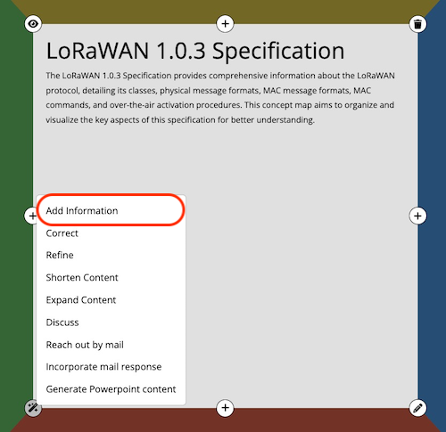
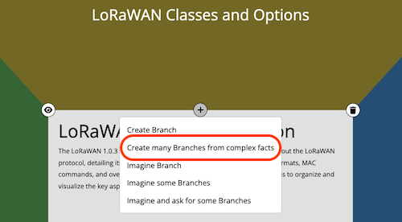
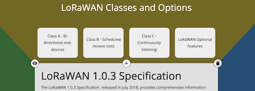

# How to start a Project in 2023 (with AI)
By 2023, generative AI has revolutionized project initiation, streamlining the traditional processes of research, brainstorming, and planning. AI's prowess in generating ideas and insights has made project planning more efficient and structured.

For technical projects, the cornerstone remains comprehensive documentation. Consider the task of 'Creating a LoRaWAN Infrastructure for thousands of IoT devices.' The key to navigating its complexities? The official LoRaWAN documentation. This resource, rich with expert insights, offers a roadmap to the technology.

However, it's essential to filter out the noise, focusing only on sections relevant to your project. This ensures efficient resource allocation and lays a solid foundation for success.

In essence, with AI tools at our disposal in 2023, initiating a project is not just about having the right resources, but also about efficiently harnessing them for a swift and successful project ramp-up.

**Setting Up the Environment with ChatGPT for Efficient Documentation**

To initiate the project "Create a LoRaWAN Infrastructure to serve thousands of IoT devices", setting up an efficient environment is crucial. Here's how to do it using ChatGPT with the PDF Reader and Conceptmap Plugins:

1. **Launch ChatGPT Session**: Begin a new ChatGPT session as your primary workspace.

2. **Enable the Plugins**: Activate both the PDF Reader and Conceptmap plugins within the session.

## Start the Concept
With the tools in place, begin instructing ChatGPT by prompting:

> Read the ToC of the PDF https://lora-alliance.org/wp-content/uploads/2020/11/lorawan1.0.3.pdf, then from that ToC create a new conceptmap

to analyze the LoRaWAN Specification's Table of Contents (ToC). Upon processing, the Conceptmap Plugin swiftly structured the information, highlighting the four most pivotal aspects from the document for a comprehensive overview.

Conceptmap suggested 6 Aspects:
1. Introduction and Conventions
2. LoRaWAN Classes and Options
3. Physical Message Formats
4. MAC Message Formats
5. MAC Commands
6. Over-the-Air Activation

choose the proper aspects. In this case we do this by prompting:

> 2, 3, combine 4 and 5 to one aspect, 6

Now let's refine the root node of the conceptmap; click on the "Add Information" Control and copy the prompt to the clipboard.

Now complete the prompt by adding:
> Read the ToC and Introduction of the PDF and add this information

Now we have a good starting point for our project. We can now begin to refine the conceptmap by adding more information to the nodes.

Do this by selecting the "Create many branches from complex facts" Control 

and copy the prompt to the clipboard and paste it into your ChatGPT chat. Instruct the prompt by adding:

> Read from the PDF all relevant information about LoRaWAN Classes and Options

This will create some new nodes in the conceptmap. From which you can drill deeper into the specification and add more and more subsections of the LoRaWAN specification.

## Shaping the Project with Selective Content Extraction

As we delve deeper into the LoRaWAN Specification, it's essential to remember that not every section will be relevant to our specific project goals. The beauty of using the Conceptmap Plugin in tandem with the PDF Reader is the ability to selectively extract and structure content, ensuring that only pertinent information is incorporated.

This phase is where your expertise and vision for the project truly come into play. While the AI tools assist in the extraction and organization, the decision on which sections to include rests with you. It's a harmonious blend of AI efficiency and human discernment.

By meticulously choosing the sections that align with the project's objectives, you ensure a streamlined and focused approach, eliminating potential distractions and information overload. This selective extraction not only optimizes the project planning phase but also sets a clear path for the subsequent stages of execution.

Remember, while AI offers a helping hand, the essence and direction of the project are molded by your insights and decisions. Embrace this synergy to craft a well-defined and successful project blueprint.

### Refining the Conceptmap with ChatGPT

With the initial structure of the conceptmap in place, filled with various aspects and topics pertinent to the project, the next step is refinement. This is where the true power of integrating ChatGPT with the Conceptmap tool shines.

The Conceptmap tool provides a visual representation of your project's scope, but it's through ChatGPT that you can dive deeper into each aspect, refining details, and ensuring clarity. Here's how:

1. **Defining Actions**: For each topic or aspect in your conceptmap, use ChatGPT to brainstorm potential actions. This could range from research tasks, stakeholder meetings, or technical implementations.

2. **Setting Milestones**: Milestones act as checkpoints in your project, ensuring you're on track and making progress. With ChatGPT's ideation capabilities, you can define meaningful milestones that align with your project's objectives.

3. **Identifying Results**: Every action should lead to a tangible result. Use ChatGPT to help visualize the outcomes of each task, ensuring that they contribute positively to the project's overall goals.

4. **Iterative Refinement**: As the project progresses, continuously engage with ChatGPT to refine the conceptmap. This iterative process ensures that the map remains relevant, updated, and in line with the project's evolving needs.

In essence, while the Conceptmap tool provides the framework, it's through ChatGPT that the content within this framework is enriched, detailed, and optimized. This synergy ensures a comprehensive and well-defined project plan, setting the stage for successful execution.

### Export the Statement of Work

Once you've meticulously refined your concept map and are satisfied with its structure and content, it's time to translate this visual representation into a tangible document: the "Statement of Work" (SoW). 

The Conceptmap tool offers a seamless HTML export feature, allowing you to generate a concise and structured SoW. This document serves as a comprehensive guide, detailing the project's scope, objectives, and deliverables. 

The flexibility of the HTML format ensures compatibility with various platforms. Whether you're looking to integrate it into Microsoft Word for further editing or importing it directly into Atlassian Confluence as the foundational blueprint for your project, the process is straightforward.

As you transition from planning to execution, consider adopting an agile approach. Agile methodologies prioritize adaptability and iterative progress, ensuring that the project remains aligned with its objectives even as requirements evolve.

With your SoW in hand and an agile mindset, you're well-equipped to kickstart your project, ensuring efficiency, clarity, and a path to success.
