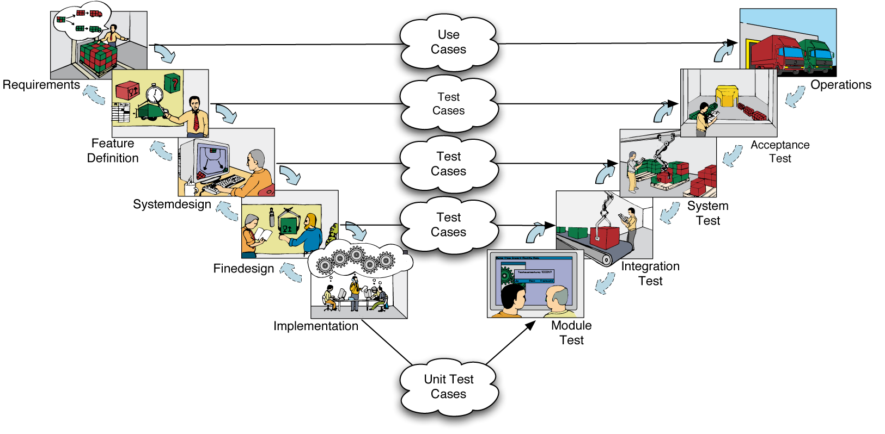

## **Reviving the V-Model in 2024: Leveraging LLMs to Write Code with Precision**

### **Introduction**
Software development in 2024 is witnessing a shift with the increasing involvement of Large Language Models (LLMs) like OpenAI o1 and Anthropics Claude 3.5 in the coding process. These models, which have now reached the skill level of at least a junior programmer, are fundamentally changing how we approach development. Notably, OpenAI's model o1 achieved a significant milestone by passing the [Mensa admission test on September 12th, 2024](https://en.futuroprossimo.it/2024/09/o1-di-openai-supera-il-test-mensa-con-120-punti-e-adesso/), further demonstrating its advanced cognitive capabilities. While impressive, this shift highlights the need for precise documentation and structured methodologies to make the most of these tools.

This blog post explores how the classic **[V-Model](https://en.wikipedia.org/wiki/V-model_(software_development)) approach**, known for its strong documentation and test-driven structure, can be revived and combined with the abilities of LLMs to not only improve the code-writing process but also ensure that the code meets well-defined customer requirements.

### Understanding the V-Model Approach

The V-Model is a structured development methodology that emphasizes the importance of both **requirements definition** and **testing**. It follows a clear, hierarchical structure, moving from broad project goals down to specific code implementations. On the left side of the model, each level of requirements—from high-level goals to individual functions—is defined, while the right side ensures that every requirement is matched by a corresponding test. 

1. **Top-to-Bottom**: The process begins with high-level project goals and works downward to more detailed requirements. Each layer represents a deeper level of specification, from project goals to individual system components, ensuring a comprehensive breakdown of what needs to be built.
   
2. **Left-to-Right**: For each defined goal, requirement, or function, a corresponding test is developed. Testing at each level ensures that every part of the project works as expected and meets the customer’s needs. When all tests pass, it signals that the project is successful. 

This approach integrates seamlessly with **Test-Driven Development (TDD)**, where writing tests before implementation ensures that every component behaves as expected from the start. By focusing on both the requirements and the tests, the V-Model provides a clear path from customer expectations to functional code, ensuring quality and alignment at every step.

However, it's important to note that the V-Model was never lived as static and rigid as it may seem. As early as 1957, iterative and incremental development was practiced in software projects [(Larman & Basili, 2003)](https://www.craiglarman.com/wiki/downloads/misc/history-of-iterative-larman-and-basili-ieee-computer.pdf). In practice, most V-Model projects often started with a **minimal set of functionality** (similar to the Minimum Viable Product, or MVP, in Agile) and then iterated over **Change Requests**, adapting and evolving the project as feedback was incorporated.

### **The Current State of LLM-Supported Software Development in 2024**
The year 2024 has seen the release of advanced LLMs such as **Claude 3.5** and **OpenAI o1**, which can generate code at a level comparable to a junior programmer. These models can efficiently produce functional code for simple applications like games, with popular examples including **Snake**, **Tetris**, and **Space Invaders**. The reason for this success is clear: the requirements of these games are widely known and well-documented, providing the LLMs with an extensive foundation for generating correct implementations.

However, in more complex real-world scenarios, we face a different challenge. Software requirements in industries like finance, healthcare, or custom enterprise applications are not predefined or universally understood. This complexity requires a structured approach, where documentation becomes essential to guide both the developers and the LLMs involved in the coding process.

### **Why Documentation is Crucial for LLMs**
Unlike traditional programmers, LLMs don’t rely on intuition or experience to understand a problem. Instead, they depend heavily on clear, well-structured input. In the real world, **requirement engineering**—whether done through formal methods or customer interviews—plays a key role in providing the level of detail necessary for successful implementation.

This is where the **V-Model approach** can make a significant difference. The V-Model emphasizes clear, structured documentation, especially in defining tests that represent customer-formulated requirements. These tests become a direct, machine-readable guide for LLMs to generate code. By formulating the requirements as tests, LLMs can more accurately implement the solution, avoiding the trial-and-error approach often seen in less structured methodologies.

### **Combining V-Model’s Structured Documentation with LLMs**
One of the key strengths of the V-Model is that the tests are derived directly from customer requirements. These tests ensure that the code generated by LLMs is aligned with what the customer expects. Here’s how combining the V-Model’s documentation with LLM-supported code generation can work:

- **Clear Requirements and Test-Driven Development**: The V-Model places a strong emphasis on defining requirements upfront, which are then translated into tests. These tests can serve as **blueprints for LLMs**, guiding them in generating code that fulfills customer requirements.
  
- **Using LLMs to Implement Best Practices**: LLMs have a tendency to implement code based on widely accepted best practices. Unlike junior programmers, who might produce complex or "exotic" code that is difficult to maintain, LLMs often avoid creating overly complicated solutions. While this might result in some unpolished or unskilled code, it is generally more maintainable than the unpredictable solutions that a junior developer might offer.
  
- **Senior Developers for Complex Requirements, LLMs and Juniors for Simpler Tasks**: In the early 2000s, teams often split development tasks between senior and junior programmers based on the complexity of the requirements. Well-defined, simple tasks were delegated to junior developers, while senior developers handled more intricate requirements. Similarly, with LLMs, you can assign simpler, well-documented tasks to the AI and reserve the more complex requirements for human experts.

### The Integral Role of Tests in the V-Model as Feedback Loop for the AI

In the V-Model, **tests** are not just a supplementary phase of the development process; they are a core component that ensures the software fulfills all customer-defined requirements. The tests do more than simply ensure that "all code" is covered—they are designed to verify that **every use case** and **requirement** is properly implemented. This approach guarantees that the software behaves as expected in all real-world scenarios, aligning perfectly with the project's goals.

One of the major advantages of integrating tests so deeply into the development cycle is the feedback loop they provide. In the context of **LLM-supported development**, this becomes even more critical. When a language model performs large-scale refactoring—which can happen in minutes, as opposed to the multi-sprint process human developers typically require—it's essential that the LLM receives immediate feedback if something goes wrong.

**Automatically running tests** provide this feedback within seconds. By ensuring the LLM is constantly guided by these tests, we can catch any potential issues as soon as they occur, allowing the LLM to correct its own work rapidly and automatically. This continuous feedback loop ensures that even when large-scale changes are made to the codebase, the project remains on track and meets all defined use cases.

### **Conclusion (TLDR): The Future of LLM-Driven Software Development**
As we move forward, the synergy between LLMs and structured development models like the V-Model offers an exciting opportunity for increasing productivity in software engineering. By maintaining clear documentation and a test-driven approach, developers can harness the power of LLMs to generate reliable, maintainable code, while senior programmers focus on the complex parts of a project that require human intuition and expertise.

In essence, the tests within the V-Model act as both a safeguard and a guide. They not only ensure that all requirements are being met but also allow for fast, iterative adjustments in the software—especially when leveraging LLMs for code generation and refactoring. This combination of comprehensive testing and rapid feedback makes the V-Model well-suited for modern AI-assisted development.

Reviving the **V-Model** as a core methodology, especially in LLM-driven development, ensures that even as technology advances, the software we build remains rooted in solid, well-defined requirements that serve the customer’s true needs.