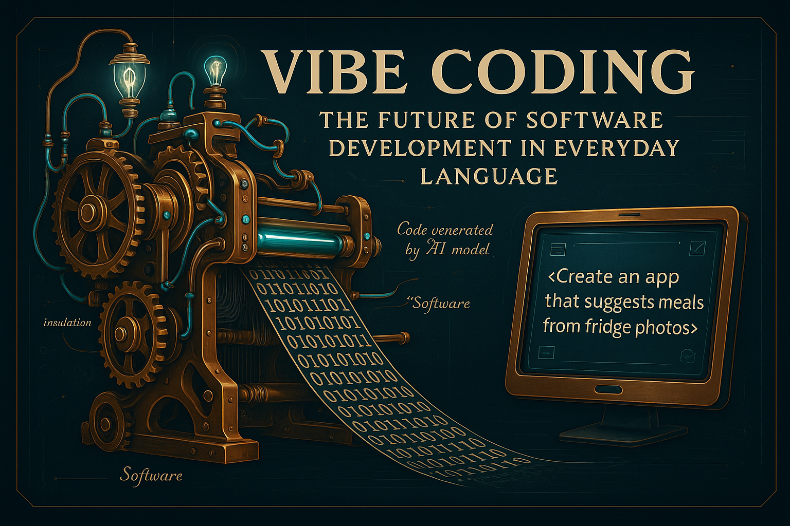

# Vibe Coding: The Future of Software Development in Everyday Language

Imagine you want an app that suggests lunch ideas based on the contents of your fridge. In the past, that would have required programming, testing, and design — or a whole development team. Today, a sentence like “Create an app that suggests meals from fridge photos” is enough — and an AI model does the rest. Welcome to the world of Vibe Coding.

**Vibe Coding** is a new approach to software development where natural language replaces manually written code. Development is no longer line-by-line but by voice command — “on vibe.” The idea: people simply describe what they need, and AI systems like GPT-4 or Claude generate functioning applications from it. What sounds like science fiction is becoming reality and changing the rules of the game.

Why is this revolutionary? Because it breaks down barriers. Everyone — from designers to bakers — can now “create” software without knowing how to code. Small teams can build products that once required entire departments. What used to take weeks can now be done in hours or minutes. Software development becomes faster, cheaper — and more accessible.

But it’s about more than just efficiency. Vibe Coding represents a cultural shift: ideas can be tested immediately. Innovation happens not only in tech companies but everywhere — in schools, startups, and living rooms. Software becomes a medium of expression, not just a product.

Sure, this method doesn't (yet) replace classical programming for safety-critical systems. But it shows how software will be created in the future: intuitive, human, and creative. Vibe Coding isn’t just a tool — it’s the first step toward a world where technology truly works for everyone.

---

## A Look Back: Mechanized Weaving as a Historical Turning Point

In 18th-century England, the Industrial Revolution marked a profound shift — especially visible in the rise of mechanized looms. Instead of weaving by hand, machines like the *Power Loom* took over — faster, more efficient, and cheaper. Factories emerged, and traditional craftsmen lost their livelihoods. Production moved from homes to large-scale textile mills. This transformation triggered massive urbanization, social unrest, and resistance — such as from the *Luddites*, who destroyed the machines. Yet this upheaval also marked the beginning of a new era: machines replaced manual labor — driving enormous productivity gains, but also disrupting society and the world of work.

---

# Vibe Coding and the Mechanical Loom – A Historical Analogy for the Digital Future

## Why Talk About Looms at All?

When thinking about modern software development, the Industrial Revolution might not be the first thing that comes to mind. Yet the **introduction of mechanical looms in Victorian England** offers surprisingly accurate parallels to what we now call **vibe coding** — the use of large language models (LLMs) like GPT to partially automate software creation.

This article doesn’t merely juxtapose these developments — it draws **direct analogies** to help explain vibe coding in a tangible, relatable way.

---

## 1. Product & Method: Two Sides of the Same Coin

One key aspect of vibe coding is that **product and method influence each other**. Code generated by an LLM is inherently different from code written manually — just as a fabric produced by machine differs from one made by hand.

A mechanical loom, for instance, requires consistent yarn on spindles. Yarn in bales might work fine in manual weaving, but not for machines. **The inputs and processes must be adapted** — and the same applies to vibe coding: we must tailor our tools, inputs, and methods for machine-assisted development from the start.

---

## 2. Language Choice: More Than Just Preference

In traditional software development, choosing a programming language often comes down to team preferences or skillsets. In vibe coding, it's different: **you must choose a language the machine understands well**.

Languages like **Python** and **TypeScript** are especially LLM-friendly because they:
- are widely used,
- have clear syntax, and
- offer vast amounts of publicly available code examples.

Personally, I prefer **TypeScript** because its strong typing provides a tighter constraint — **helpful when trying to counter hallucinations from LLMs**. Modern IDEs like VS Code also offer excellent support for debugging.

---

## 3. Infrastructure: The Framework Must Fit the Machine

Framework choice changes too. What works well in conventional projects might be problematic in vibe coding. A highly dynamic or configuration-heavy framework **can make it difficult for LLMs to generate accurate suggestions**.

Think again of the loom analogy: people used to yarn bales may have no trouble manually, but the loom expects spindles. The **entire production chain must be standardized and adjusted** before the machine can do its work effectively.

---

## 4. Standardization: Machines Don’t Tolerate Variation

Manual processes are flexible. A weaver can adjust for yarn quality, thickness, or delivery format. Machines can’t. They **require consistency** — in format, quality, and rhythm.

Vibe coding is no different: LLMs **perform best when given consistent inputs**. Varied coding styles, unclear project structures, or missing naming conventions lead to poor results.

**Best practices and standards aren’t optional — they’re essential.**

---

## 5. Continuous Integration: Machines Need Early Warning Systems

Human developers often recognize bugs instantly — thanks to context, intuition, and experience. An LLM generates results without such understanding. It **needs an automated feedback loop** to catch problems early.

This is where **continuous integration (CI) with automated tests** comes in — the machine equivalent of a human eye on the production line. Without tests, a mechanical loom might churn out flawed fabric, and no one would notice — until it's too late.

---

## 6. Changing Roles & Skills: New Machines, New Jobs

The hand weaver didn’t disappear overnight — but their role evolved. Instead of weaving, they now operated, maintained, and optimized the machines.

Vibe coding doesn't eliminate developers — but it changes **what developers must do**:
- Refine prompts
- Validate output
- Operate build/test systems
- Understand how the machine "thinks"

**Those who master this become the supervisors of tomorrow’s digital textile mills.**

---

## Conclusion: From Power Loom to Vibe Coding

The mechanical loom wasn’t just an upgrade — it **redefined the entire production model**. We’re witnessing the same transformation today with vibe coding. Those who ignore the machine get left behind.

But those who learn to work with it can unlock new levels of productivity, quality, and scalability.